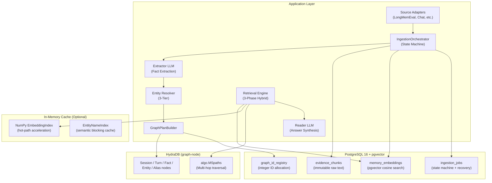
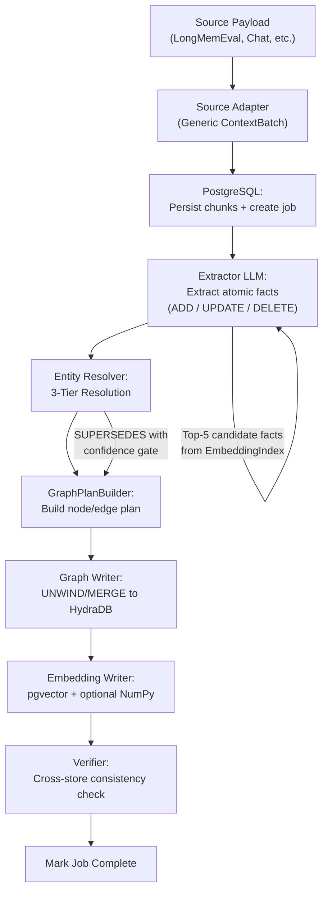
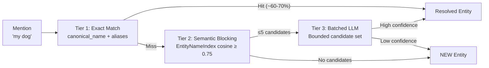

# FINAL ARCHITECTURE — HydraDB Long-Term Memory Engine

> **Status**: Accepted · Supersedes all prior architecture documents from both branches
> **Date**: 2026-08-19
> **Origin**: Unified from `main` branch (latest architecture docs) and `ingestion-hydradb-http` branch (durable ingestion engine), with explicit architectural decisions on every divergence point.

---

## Table of Contents

1. [Project Purpose](#1-project-purpose)
2. [System Overview](#2-system-overview)
3. [Storage Architecture](#3-storage-architecture)
4. [Graph Transport](#4-graph-transport)
5. [Graph Schema](#5-graph-schema)
6. [Identity & ID Generation](#6-identity--id-generation)
7. [Bitemporal Model](#7-bitemporal-model)
8. [Memory Model](#8-memory-model)
9. [Ingestion Pipeline](#9-ingestion-pipeline)
10. [Entity Resolution](#10-entity-resolution)
11. [Knowledge Updates (SUPERSEDES)](#11-knowledge-updates-supersedes)
12. [Retrieval Pipeline](#12-retrieval-pipeline)
13. [LLM Model Configuration](#13-llm-model-configuration)
14. [Embedding Strategy](#14-embedding-strategy)
15. [Source Adapters](#15-source-adapters)
16. [Package Structure](#16-package-structure)
17. [HydraDB Cypher Constraints](#17-hydradb-cypher-constraints)
18. [Infrastructure & Dependencies](#18-infrastructure--dependencies)
19. [System Modes](#19-system-modes)
20. [Decision Log](#20-decision-log)

---

## 1. Project Purpose

The **HydraDB Long-Term Memory Engine** is a production-grade, long-term memory system for AI conversational agents. It combines graph database capabilities with durable vector search and LLM extraction/reasoning.

**Two goals, one system:**

1. **Excel on the LongMemEval Benchmark** — ICLR 2025 Long-Term Memory Evaluation suite: 500 challenging questions across 6 core memory capabilities (single-session-user, single-session-assistant, multi-session, temporal-reasoning, knowledge-update, single-session-preference).
2. **Serve as an Interactive Memory Backend** — continuous multi-turn AI assistant chats with asynchronous background distillation, dynamic entity resolution, and startup hydration.

---

## 2. System Overview

The system operates across **three interconnected storage layers** coordinated by an **application orchestration layer**:



### Layer Responsibilities

| Layer | Role | Authority |
|---|---|---|
| **PostgreSQL** | Durable system of record for raw chunks, embeddings, ID registry, job state | Owns immutable evidence, vector search, ingestion recovery |
| **HydraDB** | Graph topology and traversal engine | Owns semantic relationships, entity links, multi-hop traversal |
| **In-Memory Cache** | Optional hot-path acceleration | Non-authoritative; rebuilt from PostgreSQL on startup |
| **Application** | Orchestration, extraction, resolution, ranking, synthesis | Owns all LLM logic and cross-store coordination |

> [!IMPORTANT]
> PostgreSQL and HydraDB do **not** share a transaction. Cross-store writes require stable idempotency keys, explicit job states, graph verification, retries, and safe replay.

---

## 3. Storage Architecture

### 3.1 PostgreSQL 16 + pgvector (Durable Store)

PostgreSQL is the canonical system of record for:

| Data | Table | Notes |
|---|---|---|
| Raw chunk text | `evidence_chunks` | Immutable evidence source; content-hashed |
| Chunk metadata/hash | `evidence_chunks` | Session, turn range, role, token count, source integrity |
| Embedding vector + model version | `memory_embeddings` | Re-embeddable without rewriting chunks or graph history |
| Graph integer ID registry | `graph_id_registry` | `(node_kind, context_id, logical_key)` → `INTEGER` |
| Ingestion job/outbox state | `ingestion_jobs` | Drives retries and cross-store verification |
| Full-text search index | `fact_search_index` | PostgreSQL `tsvector` column for BM25 keyword retrieval |
| Conversation buffer | `conversation_buffer` | Last 10 messages per session for extraction context |

### 3.2 HydraDB (Graph Store)

HydraDB is the canonical store for:

| Data | Notes |
|---|---|
| `Session`, `Turn`, `Fact`, `Entity`, `Alias` nodes | Graph-native records with integer IDs |
| `HAS_TURN`, `EXTRACTED_FROM`, `ABOUT`, `STATED_BY`, `SUPERSEDES`, `RELATES_TO`, `HAS_ALIAS` edges | Semantic and temporal topology |
| Provenance references to SQL chunks | `source_chunk_id` and `content_hash` properties |
| Traversal via `algo.MSpaths` | Multi-hop entity bridging across sessions |

> [!NOTE]
> HydraDB cannot store float arrays as node properties. This is why embeddings live in PostgreSQL/pgvector.

### 3.3 In-Memory Cache (Optional Hot-Path)

For latency-critical retrieval, an **optional** in-memory NumPy cache can accelerate vector search:

| Component | Purpose | Rebuilt From |
|---|---|---|
| `EmbeddingIndex` | Fast brute-force cosine search (~<1ms over ~1,200 facts) | `memory_embeddings` table |
| `EntityNameIndex` | Non-authoritative Tier-2 semantic blocking for entity resolution | `Entity` nodes via HydraDB query |

**Hydration on startup**: A `HydrationManager` queries PostgreSQL for active embeddings and batch-encodes them into the NumPy matrix. This is optional — the system can operate with pgvector-only search at slightly higher latency.

---

## 4. Graph Transport

### Decision: HTTP Transport (Not Bolt)

> [!WARNING]
> The Neo4j Python Bolt driver **crashes** during handshake with HydraDB's local `graph-node`, which returns product string `SlateDBGraph/0.1.0`. This is a hard compatibility constraint.

**Chosen transport**: Local HTTP query endpoint via `HydraHttpTransport`.

| Property | Value |
|---|---|
| Endpoint | `http://localhost:8443/v1/graphs/{graph_id}/query` |
| Auth | Bearer token |
| Consistency | Causal bookmarks for read-after-write guarantees |
| Batching | `UNWIND $rows` for efficient multi-row mutations |

The `HydraHttpTransport` class provides:
- JSON-over-HTTP Cypher query execution
- Bearer token authentication
- Causal bookmark tracking for consistency
- Error handling and retry logic

---

## 5. Graph Schema

### 5.1 Node Labels

```
Session     — one per source session inside a context
Turn        — one per user/assistant message within a session
Fact        — an atomic factual claim extracted from a turn
Entity      — a resolved canonical entity (person, place, thing, topic)
Alias       — an alternative surface form for an entity
```

### 5.2 Relationship Types

```
HAS_TURN        Session → Turn           (ordered turns within a session)
EXTRACTED_FROM  Fact → Turn              (provenance link)
ABOUT           Fact → Entity            (what entity does this fact describe)
STATED_BY       Fact → Entity            (the speaker: "User" or "Assistant" entity)
SUPERSEDES      Fact → Fact              (knowledge-update: newer replaces older)
RELATES_TO      Entity → Entity          (general semantic link between entities)
HAS_ALIAS       Entity → Alias           (alternative surface form for lookup)
MERGED_INTO     Entity → Entity          (reversible entity merge audit trail)
```

### 5.3 Node Properties

#### Session
| Property | Type | Purpose |
|---|---|---|
| `id` | `int` | HydraDB node identity (from registry) |
| `context_id` | `string` | Generic isolation boundary |
| `session_id` | `string` | Source session identifier |
| `date` | `string` | Human-readable `YYYY-MM-DD` |
| `date_epoch` | `int` | Unix epoch seconds for numeric comparison |
| `turn_count` | `int` | Number of turns in session |
| `source_index` | `int` | Original position in source array |

#### Turn
| Property | Type | Purpose |
|---|---|---|
| `id` | `int` | HydraDB node identity |
| `context_id` | `string` | Isolation boundary |
| `turn_index` | `int` | Position within session |
| `role` | `string` | `"user"` or `"assistant"` |
| `source_chunk_id` | `string` | Reference to PostgreSQL chunk |
| `content_hash` | `string` | `sha256:` prefixed hash for idempotency |
| `session_id` | `string` | Parent session identifier |

#### Fact
| Property | Type | Purpose |
|---|---|---|
| `id` | `int` | HydraDB node identity |
| `context_id` | `string` | Isolation boundary |
| `text` | `string` | Atomic factual statement |
| `speaker` | `string` | `"user"` or `"assistant"` |
| `session_id` | `string` | Source session |
| `memory_type` | `string` | `"episodic"`, `"semantic"`, or `"procedural"` |
| `scope_type` | `string` | `"chat"`, `"session"`, or `"user"` |
| `scope_id` | `string` | Matches the selected scope owner |
| `source_chunk_id` | `string` | Reference to PostgreSQL chunk |
| `source_start` | `int` | Zero-based Unicode start offset |
| `source_end` | `int` | Zero-based Unicode end offset (exclusive) |
| `content_hash` | `string` | Content-addressable hash for idempotency |
| `observed_at` | `int` | Knowledge-time: when system learned this (epoch) |
| `superseded_at` | `int` | Knowledge-time: when system stopped preferring this (epoch); `9999999999` if current |
| `valid_from` | `int` | World-validity: when this became true (epoch) |
| `valid_to` | `int` | World-validity: when this stopped being true (epoch); `9999999999` if still true |
| `created_at` | `int` | Record creation timestamp (epoch) |
| `is_current` | `boolean` | `true` if this is the active/preferred version |

#### Entity
| Property | Type | Purpose |
|---|---|---|
| `id` | `int` | HydraDB node identity |
| `context_id` | `string` | Isolation boundary |
| `name` | `string` | Display name |
| `canonical_name` | `string` | Lowercased, NFKC-normalized, trimmed |
| `selector_key` | `string` | `"{context_id}::{canonical_name}"` for global uniqueness |
| `entity_type` | `string` | Strict enum (see below) |
| `is_merged` | `boolean` | `true` if merged into another entity |

#### Alias
| Property | Type | Purpose |
|---|---|---|
| `id` | `int` | HydraDB node identity |
| `context_id` | `string` | Isolation boundary |
| `alias` | `string` | Surface form text |
| `canonical_alias` | `string` | Normalized form for matching |

### 5.4 Entity Types (Strict Enum)

```
"person", "pet", "place", "organization", "event",
"creative_work", "product", "activity", "preference", "topic", "other"
```

---

## 6. Identity & ID Generation

### Decision: Integer IDs with PostgreSQL Registry + Content Hash for Idempotency

HydraDB's Cypher engine **requires non-negative integer vertex IDs**. The system uses a PostgreSQL-backed deterministic registry.

#### Graph ID Registry

| Column | Type | Purpose |
|---|---|---|
| `node_kind` | `string` | `"session"`, `"turn"`, `"fact"`, `"entity"`, `"alias"` |
| `context_id` | `string` | Isolation boundary |
| `logical_key` | `string` | Deterministic key (e.g., `"entity:max:pet"`) |
| `graph_id` | `int` | Allocated non-negative integer |

**Behavior:**
- `allocate_graph_id(node_kind, context_id, logical_key)` returns a stable integer for every unique `(node_kind, context_id, logical_key)` tuple.
- Same key always returns the same ID (replay-safe).
- Different keys always return different IDs.

#### Content-Addressable Hashing

Content hashes (`sha256:` prefixed) are stored as **node properties** (not as IDs) for:
- Idempotency checks on replay
- Duplicate detection across ingestion runs
- Audit trail integrity

**Logical key construction examples:**
```
Session:  f"session:{context_id}:{session_id}"
Turn:     f"turn:{context_id}:{session_id}:{turn_index}"
Fact:     f"fact:{context_id}:{session_id}:{turn_index}:{fact_index}:{text_hash}"
Entity:   f"entity:{context_id}:{canonical_name}:{entity_type}"
Alias:    f"alias:{context_id}:{canonical_alias}"
```

---

## 7. Bitemporal Model

### Decision: 4-Axis Bitemporal (Knowledge Time + World Validity)

The system separates **when the system knew something** from **when it was true in the world**:

| Axis | Properties | Semantics |
|---|---|---|
| **Knowledge time** | `observed_at` / `superseded_at` | When the system learned or stopped preferring an assertion |
| **World validity** | `valid_from` / `valid_to` | When the assertion was true in the described world |

> [!IMPORTANT]
> **A correction closes knowledge time; it must NOT automatically rewrite world-validity history.**

### Examples

| Scenario | Knowledge Time | World Validity |
|---|---|---|
| "I got a dog named Max" (March 2024) | `observed_at=March`, `superseded_at=∞` | `valid_from=March`, `valid_to=∞` |
| Correction: "Actually his name is Rex" (June 2024) | Old: `superseded_at=June`; New: `observed_at=June` | Old: `valid_to` unchanged (was never true); New: `valid_from=March` (retroactive) |
| State change: "I moved to NYC" (June 2024) | Old: `superseded_at=June`; New: `observed_at=June` | Old: `valid_to=June`; New: `valid_from=June` |

---

## 8. Memory Model

Memory type and memory scope are **separate orthogonal dimensions**:

### Memory Types
| Type | Semantics |
|---|---|
| `episodic` | Timestamped source experience with immutable chunk provenance |
| `semantic` | Consolidated fact, preference, entity property, or relationship |
| `procedural` | Instruction, workflow, rule, or learned skill |

### Memory Scopes
| Scope | Semantics |
|---|---|
| `chat` | Current working scope, possibly ephemeral |
| `session` | One conversation episode |
| `user` | Durable cross-session scope and primary MVP retrieval boundary |
| `organization` | Optional shared scope — **deferred until authorization policy exists** |

**Rules:**
- Every source turn is initially `episodic`.
- `semantic` or `procedural` memories derived from it must retain `source_chunk_id`, `content_hash`, span offsets, speaker, session, and time.
- Promotion between scopes is explicit application policy.
- Never infer or promote `organization` memory automatically.
- **`chat`-scoped memories support optional TTL** (time-to-live). When a TTL is set, memories expire automatically after the specified duration. This keeps working memory clean without affecting durable `user`-scoped or `session`-scoped memories. Default TTL for `chat` scope: 24 hours (configurable).

### 8.1 Conversation Buffer

A sliding window of the **last 10 messages** from the current session is maintained in PostgreSQL. This buffer serves two purposes:

1. **Extraction context**: Fed into the extractor LLM prompt to resolve pronouns ("it", "he", "she") and short references during fact extraction.
2. **Immediate conversational context**: Provides recent context without requiring a full retrieval cycle.

---

## 9. Ingestion Pipeline

### Decision: IngestionOrchestrator Pattern with LLM Extraction (ADD/UPDATE/DELETE)

The ingestion pipeline combines the teammate's robust **IngestionOrchestrator** state machine with the main branch's simpler **LLM-as-a-function extraction** prompts.

### 9.1 High-Level Flow



### 9.2 Ingestion Job State Machine

| State | Meaning | Allowed Next States |
|---|---|---|
| `pending_graph` | SQL chunk/job durable; graph write not yet verified | `pending_embeddings`, `retryable_failed`, `terminal_failed` |
| `pending_embeddings` | Graph write verified; embeddings not yet verified | `verifying`, `retryable_failed`, `terminal_failed` |
| `verifying` | SQL, graph, and embedding provenance checks running | `completed`, `retryable_failed`, `terminal_failed` |
| `completed` | All required records verified | (terminal) |
| `retryable_failed` | Safe automatic/manual replay permitted | Prior non-terminal state, `terminal_failed`, `manual_repair` |
| `terminal_failed` | Invalid or policy-forbidden payload; no automatic retry | `manual_repair` only |
| `manual_repair` | Human intervention required | Approved non-terminal state or `terminal_failed` |

**Recovery model**: Whole-chunk idempotent replay — retrying re-runs extraction through embeddings from the top, relying on every stage's existing idempotency.

### 9.3 LLM Fact Extraction (6-Phase Distillation)

Adopted from the main branch's Mem0-inspired approach, enhanced with conversation buffer context:

1. **Phase 1 — Context Assembly**: Build the extraction prompt from three sources:
   - **Conversation Buffer**: Last 10 messages from the current session (stored in PostgreSQL). Critical for resolving pronouns ("it", "he", "she") and short references during extraction.
   - **Candidate Facts**: Top-5 existing facts via `EmbeddingIndex` (pgvector or NumPy cache) to detect updates/contradictions.
   - **Current Turn**: The new user/assistant message being processed.
2. **Phase 2 — Structured Extraction**: Extractor LLM produces `ExtractedMemory` payloads with atomic facts, entities, and actions (`ADD`, `UPDATE`, `DELETE`).
3. **Phase 3 — Action Routing**:
   - `ADD` → Create new Fact node
   - `UPDATE` → Create new Fact + SUPERSEDES edge (with confidence gate, see §11)
   - `DELETE` → Invalidate old fact (`is_current = false`, close `superseded_at`)
4. **Phase 4 — Dual-Store Ingestion**: HydraDB Cypher writes + pgvector embedding writes
5. **Phase 5 — Lemmatization & Full-Text Indexing**: Store lemmatized fact text in PostgreSQL `tsvector` column for BM25 keyword retrieval (see §12).
6. **Phase 6 — Async Background Worker**: Off the critical interaction path for interactive mode

> [!TIP]
> The conversation buffer dramatically improves extraction quality in interactive mode. For benchmark mode, each haystack's full session history serves the same purpose.

### 9.4 Derived Memory Candidate Contract

Output shape required from the extractor before graph or embedding work:

| Field | Type | Required | Rule |
|---|---|---|---|
| `candidate_id` | `string` | yes | Stable only within one extraction attempt |
| `text` | `string` | yes | Atomic claim/instruction; non-empty |
| `memory_type` | `enum` | yes | `episodic`, `semantic`, or `procedural` |
| `scope_type` | `enum` | yes | `chat`, `session`, or `user` |
| `scope_id` | `string` | yes | Matches the selected scope owner |
| `source_record_id` | `string` | yes | Record providing direct evidence |
| `source_start` / `source_end` | `int` | yes | Zero-based Unicode code-point offsets |
| `confidence` | `float` | yes | `0.0..1.0` inclusive |
| `observed_at` | `timestamp` | yes | Copied from source record |
| `valid_from` / `valid_to` | `timestamp` or `null` | no | World-validity claim |
| `entities` | `array` | no | Candidate entity surfaces for resolution |
| `predicate_key` | `string` | no | For SUPERSEDES matching (see §11) |

---

## 10. Entity Resolution

### Decision: 3-Tier Strategy (Main Branch) with Bounded-Candidate Guardrails



### Tier 1 — Exact Match (Zero Cost)
- Lookup against `Entity.canonical_name` and `Alias.canonical_alias` in HydraDB
- Unicode NFKC normalization, trimmed/collapsed whitespace, case-folded
- Expected ~60-70% hit rate

### Tier 2 — Semantic Blocking (Zero LLM Cost)
- In-memory `EntityNameIndex` (`all-MiniLM-L6-v2`) with threshold ≥ 0.75
- Produces candidate set of ≤5 candidates
- Non-authoritative cache — rebuilt from PostgreSQL/HydraDB on demand

### Tier 3 — Batched LLM Confirmation
- Batches **all** unresolved mentions from a single turn into 1 structured LLM call
- LLM may choose **only** from the bounded, application-supplied candidate set
- Invalid selection or abstention defaults to `NEW` (never a cross-context identity link)
- Low-confidence matches default to `NEW`

### Entity Merging
- Reversible via `(source)-[:MERGED_INTO]->(target)` with `is_merged = true`
- Edge re-pointing preserves audit trail

---

## 11. Knowledge Updates (SUPERSEDES)

### Decision: Build SUPERSEDES with Confidence Gate + Predicate Key Matching

SUPERSEDES edges are created **only** when the extraction provides sufficient confidence:

### Conditions for SUPERSEDES Edge Creation

1. **Same subject entity** — resolved to the same canonical entity
2. **Same predicate key** — extraction outputs a `predicate_key` (e.g., `"job_title"`, `"pet_breed"`) that matches an existing fact
3. **Newer `observed_at`** — the new assertion was observed after the old one
4. **Confidence gate** — extraction confidence ≥ threshold (tunable, default 0.7)

### Update Classification

The `TemporalUpdateClassifier` distinguishes:

| Classification | Knowledge Time Effect | World Validity Effect |
|---|---|---|
| `CORRECTION` | Closes `superseded_at` on old fact | Does NOT change `valid_to` — old fact was never true |
| `STATE_CHANGE` | Closes `superseded_at` on old fact | Closes `valid_to` on old fact at `valid_from` of new fact |
| `NO_UPDATE` | No change | No change |
| `UNRESOLVED` | Deferred — no edge created | Deferred |

### When SUPERSEDES is Created

```cypher
-- Create new fact
CREATE (f_new:Fact { ... , is_current: true })

-- Link to old fact
CREATE (f_new)-[:SUPERSEDES]->(f_old)

-- Close old fact
SET f_old.is_current = false
SET f_old.superseded_at = $new_observed_at

-- For STATE_CHANGE only:
SET f_old.valid_to = $new_valid_from
```

> [!NOTE]
> If the extractor does not produce a `predicate_key` (e.g., deterministic baseline), SUPERSEDES edges are **not** created. This is a documented, intentional gap — not an oversight.

---

## 12. Retrieval Pipeline

### Enhanced 4-Phase Hybrid Retrieval

Combines our graph-based approach with Mem0-inspired over-fetching, BM25 keyword matching, entity boost scoring, and query rewriting.

#### Phase 0 — Temporal Pruning + Query Rewriting

**Step 1 — Temporal Resolution** (existing):
1. **Fast LLM call**: Infers `[start_date, end_date]` relative to `question_date`
2. **±2 days buffer padding**: Adds 172,800 seconds margin
3. **Epoch conversion**: Converts to Unix epoch for filtering in both pgvector and HydraDB

**Step 2 — Query Rewriting** (Mem0-inspired, new):
- A cheap LLM call decomposes complex/multi-part questions into optimized retrieval queries
- Adds synonyms and clarifies implicit references
- Example: `"What breed is my dog and where did I adopt him?"` → `["user's dog breed", "user dog adoption location"]`
- Uses the same small model as the Temporal Resolver (low incremental cost)

> [!TIP]
> Query rewriting generalizes temporal resolution — both transform the raw question into a better retrieval signal. They can share a single LLM call.

#### Phase 1 — Semantic + Keyword Seeding

**Over-fetching for reranking**: Retrieve `max(top_k × 4, 60)` candidates, not just `top_k`. More candidates = better chance of catching relevant facts before the reranking step filters to the final set.

**Semantic search** (primary):
```sql
-- pgvector exact cosine search
SELECT subject_id, 1 - (embedding <=> :query_embedding) AS cosine_similarity
FROM memory_embeddings
WHERE context_id = :context_id
  AND subject_kind = 'fact'
  AND is_active = true
  AND model_name = :model_name
  AND model_version = :model_version
ORDER BY embedding <=> :query_embedding
LIMIT :candidate_pool_size;  -- max(top_k × 4, 60)
```

Optional acceleration: If in-memory `EmbeddingIndex` is hydrated, use NumPy brute-force matrix multiplication (<1ms) as primary search, with pgvector as fallback/verification.

**BM25 keyword search** (complementary):
```sql
-- PostgreSQL full-text search on lemmatized fact text
SELECT f.fact_id, ts_rank_cd(f.text_tsvector, query) AS bm25_score
FROM fact_search_index f, plainto_tsquery(:language, :query_text) query
WHERE f.context_id = :context_id
  AND f.is_active = true
  AND f.text_tsvector @@ query
ORDER BY ts_rank_cd(f.text_tsvector, query) DESC
LIMIT :candidate_pool_size;
```

The union of semantic and keyword candidates forms the initial candidate pool. BM25 catches exact keyword matches that embedding similarity misses (e.g., searching for "labrador" directly matches facts containing "labrador" even if the embedding prefers generic "dog breed" vectors).

#### Phase 2 — Graph Expansion

1. **Entity Collection**: Extract entities connected to seed facts via `[:ABOUT]`
2. **Multi-Entity Bridging**: `algo.MSpaths` with `relTypes: ['ABOUT']`, `maxLen: 4` to discover hidden cross-session connections
3. **Single-Entity Expansion**: Current facts for each entity
4. **SUPERSEDES Chain Traversal**: `[:SUPERSEDES*1..5]` to find the most recent valid state
5. **Temporal Filtering**: `WHERE f.valid_from <= $query_epoch AND f.valid_to >= $query_epoch`
6. **Knowledge-Time Filtering**: `WHERE f.observed_at <= $query_epoch AND f.superseded_at >= $query_epoch`

#### Phase 3 — Multi-Factor Scoring & Synthesis

**4-factor scoring formula:**

```
composite_score = (semantic_score + keyword_score + structural_score + entity_boost) / 3.0

Where:
  semantic_score  ∈ [0.0, 1.0]  — cosine similarity from Phase 1
  keyword_score   ∈ [0.0, 1.0]  — normalized BM25 score from Phase 1
  structural_score ∈ [0.0, 1.0] — graph proximity from Phase 2
  entity_boost    ∈ [0.0, 0.5]  — entity relevance with inverse frequency weighting
```

**Structural score** (graph-based):
```
structural_score = (1.0 / hop_count) × min(path_count, 3) / 3.0
```

**Entity boost** (Mem0-inspired, enhanced with graph data):
```python
def entity_boost(fact, query_entities, entity_fact_counts):
    """
    Boost facts linked to query-mentioned entities.
    Rarer entities → higher boost (more specific signal).
    """
    boost = 0.0
    for entity in fact.linked_entities:
        if entity in query_entities:
            # Inverse frequency: entities linked to fewer facts are more specific
            frequency = entity_fact_counts[entity.id]
            boost += 0.5 / max(frequency, 1)
    return min(boost, 0.5)  # Cap at 0.5
```

**Abstention logic:**
- If `best_semantic_score < 0.25` AND `len(expanded_facts) == 0` → return `"I don't have that information in my memory."`

**Context assembly:**
- Progressive evidence expansion: exact span → neighboring turn → full chunk (never full-chunk-by-default)
- Top 15 ranked facts formatted as: `[YYYY-MM-DD | speaker]: fact text`
- **Reader LLM** synthesizes the final grounded answer

---

## 13. LLM Model Configuration

### Decision: Multi-Model Role Allocation with Provider-Neutral Client

| Role | Model Class | Default Provider | Purpose |
|---|---|---|---|
| **Extractor** | Small/fast (8-20B) | Fireworks `deepseek-v4-flash` | High-volume structured fact extraction |
| **Reader** | Large/capable (70-120B) | Fireworks or OpenRouter `llama-3.3-70b` | Answer synthesis and date reasoning |
| **Judge** | Evaluator | OpenRouter `llama-3.3-70b` or `gpt-4o-mini` | Scoring predictions against ground truth |
| **Entity Resolver** | Small/fast | Fireworks `deepseek-v4-flash` | Tier-3 entity disambiguation |
| **Temporal Resolver** | Small/fast | Fireworks `deepseek-v4-flash` | Date range extraction from queries |
| **Query Rewriter** | Small/fast | Fireworks `deepseek-v4-flash` | Pre-retrieval query decomposition, synonym expansion |

### Universal LLMClient

A single `LLMClient` class wraps the OpenAI-compatible API:
- **Provider-neutral**: Supports Fireworks AI, OpenRouter, Groq, vLLM, and any OpenAI-compatible endpoint
- **Structured output**: JSON schema validation via Pydantic models
- **Concurrency**: `asyncio.Semaphore` with exponential backoff on HTTP 429
- **Configuration**: Via environment variables (base URL, API key, model name per role)

---

## 14. Embedding Strategy

### Model: `sentence-transformers/all-MiniLM-L6-v2`

| Property | Value |
|---|---|
| Dimensions | 384 |
| Parameters | 22M |
| Speed (CPU) | ~5ms per sentence |
| Model size | ~80 MB |
| License | Apache 2.0 |

### Dual-Store Embedding Architecture

1. **PostgreSQL/pgvector** (authoritative): `memory_embeddings` table with exact cosine search, scoped by `context_id` and `model_version`
2. **In-Memory NumPy** (optional cache): Brute-force matrix multiplication over ~1,200 facts in <1ms

**Embedding targets**: Validated fact text only in MVP. Chunk embeddings are a held future experiment.

**Re-embedding**: Inserts a new `model_version` row rather than mutating source chunks. Superseded embeddings remain durable for historical/temporal retrieval.

**Startup hydration** (if using in-memory cache):
```python
# Query PostgreSQL for active embeddings
# Batch-encode into NumPy matrix (batch_size=64)
# ~6-7 seconds for full index rebuild
```

---

## 15. Source Adapters

### Decision: Generic Source Adapter Pattern

The core domain is **decoupled from any specific data source**. LongMemEval enters through a dedicated adapter that emits the same canonical records as any other source.

### Generic ContextBatch / ContextRecord v1 Contract

**Input envelope:**

| Field | Type | Required | Rule |
|---|---|---|---|
| `context_id` | `string` | yes | Generic isolation boundary |
| `contract_version` | `string` | yes | Must be `"v1"` |
| `source_type` | `string` | yes | Adapter identifier (e.g., `"longmemeval"`, `"chat"`) |
| `sessions` | `array` | yes | Array of `ContextSession` objects |

**ContextSession:**

| Field | Type | Required |
|---|---|---|
| `session_id` | `string` | yes |
| `occurred_at` | `string` | yes |
| `records` | `array[ContextRecord]` | yes |

**ContextRecord:**

| Field | Type | Required |
|---|---|---|
| `record_id` | `string` | yes |
| `actor_role` | `string` | yes |
| `content` | `string` | yes |
| `metadata` | `object` | no |

### LongMemEval Adapter Specifics

- Parses `%Y/%m/%d (%a) %H:%M` timestamps (minute precision, no timezone)
- Applies UTC only as benchmark-local ordering basis
- Stable-sorts sessions by parsed timestamp
- Qualifies canonical session/record IDs with source array index
- Skips empty-text turns (12 found in dataset)
- Handles 13 instances with repeated session IDs
- Benchmark labels (`question_id`, `question_type`, `has_answer`, `answer`) stay in evaluation code — **never** in core domain models

---

## 16. Package Structure

### Decision: Main Branch Layout with Teammate's Additions Integrated

```
src/
├── core/
│   ├── config.py              # Environment configuration and model allocation
│   ├── llm_client.py          # Universal provider-neutral LLMClient
│   ├── models.py              # Domain models, Pydantic schemas, enums
│   ├── validation.py          # Contract validation rules
│   ├── errors.py              # Custom exception hierarchy
│   └── enums.py               # Memory types, scopes, entity types, job states
├── db/
│   ├── graph_client.py        # HydraDB HTTP transport wrapper
│   ├── embedding_index.py     # In-memory EmbeddingIndex and EntityNameIndex (numpy)
│   └── postgres.py            # PostgreSQL persistence (chunks, embeddings, jobs, IDs)
├── memory/
│   ├── engine.py              # Core orchestrator: add_turn_async(), search(), generate_reply(), hydrate()
│   ├── retrieval.py           # 3-phase hybrid retrieval with algo.MSpaths
│   └── distillation.py        # LLM extraction, action routing, SUPERSEDES
├── entities/
│   ├── resolver.py            # 3-tier entity resolution orchestrator
│   └── semantic_blocking.py   # Tier-2 semantic blocking with EntityNameIndex
├── ingestion/
│   ├── orchestrator.py        # IngestionOrchestrator state machine (job lifecycle)
│   ├── graph_plan_builder.py  # Maps candidates + entities → GraphWritePlan
│   ├── graph_writer.py        # Batched UNWIND/MERGE execution against HydraDB
│   ├── extraction.py          # LLM fact extraction service
│   ├── embedding.py           # Embedding computation and pgvector writes
│   ├── ports.py               # Protocol ports (Embedder, Extractor, EntityResolver, etc.)
│   ├── fakes.py               # Deterministic fakes for testing
│   └── sources/
│       ├── longmemeval.py     # LongMemEval source adapter
│       └── chat.py            # Interactive chat source adapter
├── chat/
│   └── interactive_chat.py    # CLI chat interface for testing
├── api/
│   ├── server.py              # FastAPI application and uvicorn runner
│   └── routes.py              # HTTP REST endpoints
├── evaluation/
│   └── benchmark_runner.py    # LongMemEval benchmark runner → predictions.jsonl
├── migrations/
│   ├── 0001_initial.sql       # evidence_chunks, graph_id_registry, ingestion_jobs
│   ├── 0002_extraction.sql    # Extraction audit columns
│   └── 0003_graph_manifest.sql # Graph write manifest tracking
└── tests/
    ├── test_contract_v1.py
    ├── test_domain_validation.py
    ├── test_embedding.py
    ├── test_extraction_service.py
    ├── test_graph_plan_builder.py
    ├── test_orchestrator.py
    ├── test_resolution_service.py
    ├── test_postgres_persistence.py
    └── ...
```

---

## 17. HydraDB Cypher Constraints

### Supported

| Feature | Notes |
|---|---|
| `MATCH` (directed, one rel type each) | ✅ |
| `OPTIONAL MATCH` (reads only) | ✅ |
| `WHERE` (`=`, `<>`, `<`, `>`, `<=`, `>=`, `STARTS WITH`, `AND`, `OR`, `NOT`) | ✅ |
| `RETURN` with `DISTINCT`, `ORDER BY`, `SKIP`, `LIMIT` | ✅ |
| Aggregates: `count`, `sum`, `avg`, `collect` | ✅ |
| `UNION` / `UNION ALL` | ✅ |
| `WITH` (pass-through only) | ✅ |
| `CREATE`, `MERGE` (by id), `SET`, `DELETE`, `DETACH DELETE` | ✅ |
| `UNWIND $rows` batched writes | ✅ |
| Variable-length paths `*min..max` (max required) | ✅ |
| `algo.SPpaths`, `algo.SSpaths`, `algo.MSpaths` | ✅ |

### NOT Supported (Hard Constraints)

| Feature | Workaround |
|---|---|
| `IN [list]` | Use `UNWIND` + `MATCH` |
| `ENDS WITH`, `CONTAINS`, `IS NULL` | Application-side filtering |
| `RETURN *` | Explicit property projection |
| `min()`, `max()` aggregates | Application-side computation |
| `DISTINCT` inside aggregate arguments | Application-side dedup |
| `WITH` aliasing/filtering/ordering | Split into separate queries |
| Unbounded variable-length paths | Always specify `*1..N` |
| `ON CREATE` / `ON MATCH` on `MERGE` | Separate `MATCH` + `CREATE` |
| Float arrays as properties | Embeddings in PostgreSQL |
| Multiple statements per request | One query per HTTP call |
| Undirected relationship patterns | Explicit direction always |
| Multi-type relationships in one MATCH | Separate MATCH clauses |

### Consistency Model

- **Causal** (default): Uses the node's current durable reader view with bookmark tracking
- **Strong**: Refreshes from object storage before pinning snapshot
- **Single writer per cell**: Mutations are serialized; no concurrent-write conflicts

---

## 18. Infrastructure & Dependencies

### Runtime Stack

| Layer | Technology |
|---|---|
| Language | Python 3.12+ |
| Graph Database | HydraDB `graph-node` (Rust, SlateDB storage) |
| Relational DB | PostgreSQL 16 + pgvector 0.8.6 |
| Graph Client | `httpx` (HTTP transport to HydraDB) |
| Embeddings | `sentence-transformers` (`all-MiniLM-L6-v2`), `numpy` |
| LLM Client | `openai` SDK (provider-neutral) |
| Schemas | `pydantic` ≥ 2.0 |
| Web API | `fastapi`, `uvicorn` |
| SQL Driver | `psycopg[binary]` (Psycopg 3) |
| Testing | `pytest`, `unittest` |
| Package Manager | `uv` |

### Local Development

```yaml
# compose.yaml
services:
  postgres:
    image: pgvector/pgvector:0.8.0-pg16
    ports: ["5432:5432"]
    environment:
      POSTGRES_DB: context_memory
      POSTGRES_USER: dev
      POSTGRES_PASSWORD: dev
```

### Environment Variables

| Variable | Purpose | Required |
|---|---|---|
| `HYDRA_DB_API_KEY` | Bearer token for HydraDB HTTP | Yes |
| `HYDRA_DB_GRAPH_ID` | Target graph ID in HydraDB | Yes |
| `HYDRA_DB_HOST` | HydraDB HTTP host | Yes (default: `localhost:8443`) |
| `DATABASE_URL` | PostgreSQL connection string | Yes |
| `FIREWORKS_API_KEY` | Fireworks AI LLM provider | Yes (for LLM features) |
| `EXTRACTOR_MODEL` | Model name for extraction | No (default configured) |
| `READER_MODEL` | Model name for synthesis | No (default configured) |
| `JUDGE_MODEL` | Model name for evaluation | No (default configured) |

---

## 19. System Modes

### Interactive Mode
- Async ingestion via background workers
- Real-time fact extraction and entity resolution
- `hydrate()` on startup rebuilds in-memory caches from PostgreSQL
- Continuous entity deduplication
- Full IngestionOrchestrator job tracking

### Benchmark Mode
- Fast, per-question ingestion
- Loops through 500 questions in `longmemeval_s_cleaned.json`
- Generates `predictions.jsonl` via Reader LLM
- Zero cross-test contamination (fresh `context_id` per haystack)
- LLM-as-judge scoring (GPT-4o-mini or equivalent)

---

## 20. Decision Log

Summary of all major architectural decisions in this unified document:

| # | Decision | Source | Rationale |
|---|---|---|---|
| D-01 | **Hybrid vector storage** (pgvector + optional NumPy cache) | Merged | Durability from pgvector, speed from NumPy when needed |
| D-02 | **HTTP transport** over Bolt | Feature branch | Bolt driver crashes on HydraDB's `SlateDBGraph/0.1.0` — hard constraint |
| D-03 | **Integer IDs** with PostgreSQL registry | Feature branch | HydraDB requires non-negative integer vertex IDs — hard constraint |
| D-04 | **Content hashes as properties** (not IDs) | Merged | Preserves idempotency benefits without conflicting with integer ID requirement |
| D-05 | **IngestionOrchestrator** with state machine | Feature branch | Production-grade recovery, idempotent replay, explicit job lifecycle |
| D-06 | **LLM extraction with ADD/UPDATE/DELETE** | Main branch | Simpler, more natural extraction prompts; proven Mem0-inspired approach |
| D-07 | **PostgreSQL for chunks, embeddings, IDs, jobs** | Feature branch | Durability without duplicating graph data in HydraDB |
| D-08 | **HydraDB as sole graph authority** | Merged | No graph data duplication; clear ownership boundary |
| D-09 | **Generic source adapter pattern** | Feature branch | Clean separation; LongMemEval is just one source |
| D-10 | **SUPERSEDES with confidence gate** | Merged | Build the edge, but only when `predicate_key` + confidence threshold are met |
| D-11 | **4-axis bitemporal model** | Feature branch | Handles corrections vs. state changes precisely |
| D-12 | **3-tier entity resolution** | Main branch | Cost-effective: exact match handles 60-70%, semantic blocking avoids most LLM calls |
| D-13 | **Multi-model role allocation** | Main branch | Right-sized models for each task (small for extraction, large for synthesis) |
| D-14 | **Provider-neutral LLMClient** | Merged | Supports Fireworks (default), OpenRouter, Groq, etc. |
| D-15 | **Main branch package structure** | Main branch | Clean `src/` layout with teammate's additions (ingestion/, sources/) integrated |
| D-16 | **Whole-chunk idempotent replay** for recovery | Feature branch | Simpler than per-stage checkpointing; relies on idempotency of each stage |
| D-17 | **Conversation buffer** (last 10 messages) for extraction | Mem0-inspired | Critical for pronoun resolution; trivial to implement; high extraction quality improvement |
| D-18 | **BM25 keyword matching** via PostgreSQL `tsvector` | Mem0-inspired | Free infrastructure (already have Postgres); catches exact keyword matches semantic search misses |
| D-19 | **Entity boost with inverse frequency weighting** | Mem0-inspired | Rarer entities are more specific signals; merged into our graph-based structural scoring |
| D-20 | **Query rewriting** before retrieval | Mem0-inspired | One cheap LLM call that decomposes complex questions; proven recall improvement |
| D-21 | **Over-fetching candidates** for reranking (`max(top_k×4, 60)`) | Mem0-inspired | One-line change; more candidates for reranking = better final selection |
| D-22 | **TTL for chat-scoped memories** | Mem0-inspired | Keeps working memory clean; only for `chat` scope, not durable `user` memories |
| D-23 | **Direct embedding mode deferred** | Mem0-evaluated | System's value comes from graph structure; raw embedding loses entity/fact topology |
