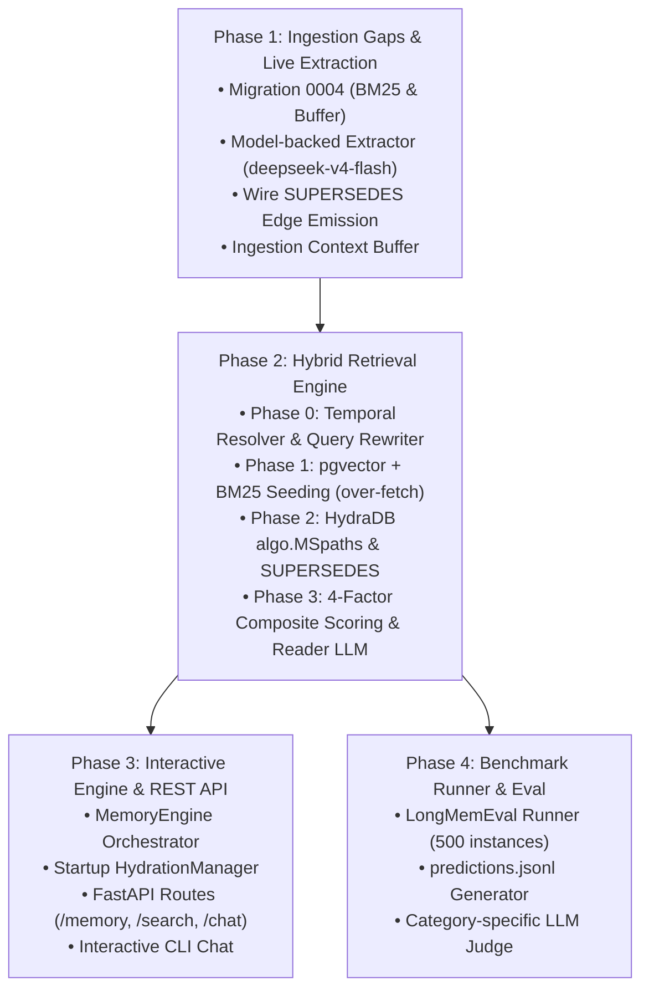

# Next Steps & Implementation Roadmap

> **Source of Truth**: [FINAL_ARCHITECTURE.md](file:///home/aryan-sherigar/projects/hydradb-hackathon/FINAL_ARCHITECTURE.md)  
> **Status**: Living execution plan for branch `final_merge`  
> **Date**: 2026-08-19  

---

## 1. Current State Assessment

With the merge into `final_merge` completed and all 119 unit/contract tests passing:

| Subsystem | Implemented Components | Pending Work / Gaps |
|---|---|---|
| **Storage & Persistence** | PostgreSQL 16 schema, migrations `0001`-`0003`, `PostgresChunkStore`, `PostgresEmbeddingStore`, `PostgresJobStore`, `allocate_graph_id` | Migration `0004` for `conversation_buffer` and `fact_search_index` (BM25 `tsvector`) |
| **Graph Transport** | `HydraHttpTransport` (local HTTP OpenCypher query endpoint with token auth and causal bookmarks) | Live end-to-end testing against running `graph-node` binary |
| **Ingestion Engine** | `IngestionOrchestrator` state machine, `GraphPlanBuilder`, `GraphWriter`, 3-tier entity resolution, bitemporal classifier, deterministic fakes, `LongMemEval` source adapter | Real model-backed extraction, `SUPERSEDES` edge emission in plan builder, conversation buffer in extraction |
| **In-Memory Cache** | `EmbeddingIndex` & `EntityNameIndex` (numpy matrix search) | Startup hydration manager wiring (`HydrationManager`) |
| **Retrieval Engine** | Architecture fully specified (§12 of `FINAL_ARCHITECTURE.md`) | Implementation required (Phases 0–3, `algo.MSpaths`, 4-factor scoring, Reader LLM) |
| **API & CLI** | Basic FastAPI health server | Full REST routes (`/memory`, `/search`, `/chat`) and interactive CLI |
| **Benchmark Runner** | Adapter and fixtures in place | `benchmark_runner.py` to evaluate over `longmemeval_s_cleaned.json` → `predictions.jsonl` |

---

## 2. Phased Implementation Roadmap



---

## Phase 1: Ingestion Gaps & Live Extraction

### Objective
Complete the ingestion pipeline by adding the conversation buffer, BM25 indexing, real structured LLM extraction, and wiring `SUPERSEDES` edge creation into `GraphPlanBuilder`.

### Tasks
1. **Database Migration `0004_buffer_and_bm25.sql`**:
   - Create `conversation_buffer` table:
     ```sql
     CREATE TABLE conversation_buffer (
         buffer_id BIGSERIAL PRIMARY KEY,
         context_id TEXT NOT NULL,
         session_id TEXT NOT NULL,
         turn_index INTEGER NOT NULL,
         role TEXT NOT NULL,
         content TEXT NOT NULL,
         created_at TIMESTAMPTZ NOT NULL DEFAULT now()
     );
     CREATE INDEX conv_buffer_lookup_idx ON conversation_buffer (context_id, session_id, turn_index DESC);
     ```
   - Create `fact_search_index` table (or add `text_tsvector` to `memory_embeddings` / dedicated table) for BM25:
     ```sql
     CREATE TABLE fact_search_index (
         fact_id INTEGER PRIMARY KEY,
         context_id TEXT NOT NULL,
         raw_text TEXT NOT NULL,
         text_tsvector tsvector GENERATED ALWAYS AS (to_tsvector('english', raw_text)) STORED,
         is_active BOOLEAN NOT NULL DEFAULT true,
         created_at TIMESTAMPTZ NOT NULL DEFAULT now()
     );
     CREATE INDEX fact_tsvector_idx ON fact_search_index USING GIN (text_tsvector);
     ```
2. **Model-Backed Extractor (`src/context_memory/ingestion/extraction.py`)**:
   - Implement `LLMExtractionService` using `LLMClient.structured_completion()` targeting `deepseek-v4-flash` / `llama-3.1-8b`.
   - Implement the 6-phase extraction workflow (§9.3):
     - Load last 10 messages from `conversation_buffer` for pronoun resolution.
     - Retrieve top-5 candidate facts from embedding index.
     - Extract atomic facts, entities, `predicate_key`, and `ADD`/`UPDATE`/`DELETE` actions.
3. **Wire `SUPERSEDES` in `GraphPlanBuilder` (§11)**:
   - When candidate includes `predicate_key` and matches an existing fact on `(subject, predicate)` with newer `observed_at`:
     - Invoke `TemporalUpdateClassifier`.
     - Emit `(f_new)-[:SUPERSEDES]->(f_old)` edge in `GraphWritePlan`.
     - Add Cypher mutations to set `f_old.is_current = false` and update `superseded_at` / `valid_to`.
4. **Unit Tests**:
   - Add tests for `0004` migration.
   - Test LLM extraction output schema validation and fallback.
   - Test `GraphPlanBuilder` generating `SUPERSEDES` relationships.

---

## Phase 2: Hybrid Retrieval Engine

### Objective
Implement the complete 4-phase hybrid retrieval pipeline as specified in §12 of `FINAL_ARCHITECTURE.md`.

### Tasks
1. **Module Creation: `src/memory/retrieval.py`**:
   - **Phase 0 — Temporal Resolution & Query Rewriting**:
     - `TemporalQueryResolver`: LLM extracts date range relative to `question_date` + ±2 days buffer (172,800s).
     - `QueryRewriter`: LLM generates decomposed search queries and synonyms.
   - **Phase 1 — Semantic + Keyword Seeding (Over-fetching)**:
     - Query pgvector for cosine similarity: `LIMIT max(top_k * 4, 60)`.
     - Query PostgreSQL `fact_search_index` for BM25 match: `ts_rank_cd(text_tsvector, plainto_tsquery(...))`.
     - Fuse semantic and keyword candidate sets.
   - **Phase 2 — HydraDB Graph Expansion**:
     - Extract connected `Entity` nodes (`[:ABOUT]`).
     - Execute `algo.MSpaths` across entities (`relTypes: ['ABOUT']`, `maxLen: 4`) via `HydraHttpTransport`.
     - Traverse `[:SUPERSEDES*1..5]` to resolve update chains.
     - Apply bitemporal epoch filters: `valid_from <= qe <= valid_to` AND `observed_at <= qe <= superseded_at`.
   - **Phase 3 — 4-Factor Composite Scoring & Synthesis**:
     - Compute: `composite_score = (semantic + keyword + structural + entity_boost) / 3.0`.
     - Calculate graph structural score: `(1.0 / hop_count) * min(path_count, 3) / 3.0`.
     - Calculate entity boost with inverse frequency weighting: `0.5 / max(entity_fact_count, 1)`.
     - Apply honest abstention check (`semantic_score < 0.25` and no graph paths → return `"I don't have that information in my memory."`).
     - Assemble progressive context (exact span → turn → chunk) for top 15 ranked facts.
     - Format as `[YYYY-MM-DD | speaker]: fact text` and prompt Reader LLM (`llama-3.3-70b` / `gpt-oss-120b`).
2. **Unit & Integration Tests**:
   - Test temporal range extraction with dates and relative words.
   - Test query rewriter outputs.
   - Test candidate fusion and 4-factor scoring calculations.
   - Test abstention triggering on irrelevant questions.

---

## Phase 3: Interactive Engine & REST API

### Objective
Provide clean programmatic and HTTP interfaces for conversational memory management.

### Tasks
1. **`src/memory/engine.py` (`MemoryEngine`)**:
   - `add_turn_async(context_id, session_id, role, content, timestamp)`: Ingests turn via `IngestionOrchestrator` and records to conversation buffer.
   - `search_memories(context_id, query, question_date)`: Executes hybrid retrieval pipeline.
   - `generate_reply(context_id, session_id, user_message)`: Retrieves context, prompts assistant LLM, records response.
   - `hydrate(context_id)`: Pre-populates in-memory `EmbeddingIndex` and `EntityNameIndex` from Postgres.
2. **`src/api/routes.py` & `src/api/server.py`**:
   - `POST /v1/memory/ingest` — Accept generic `ContextBatch` payload.
   - `POST /v1/memory/search` — Query memories with `query`, `context_id`, optional `question_date`.
   - `POST /v1/chat` — Turn-by-turn chat with automatic memory distillation.
   - `GET /v1/health` — Readiness and dependency checks (Postgres, HydraDB).
3. **CLI Chat Interface (`src/chat/interactive_chat.py`)**:
   - Terminal REPL for interactive chatting, viewing extracted facts, and inspecting retrieved context.

---

## Phase 4: LongMemEval Benchmark Runner & Evaluation

### Objective
Execute end-to-end evaluation over `longmemeval_s_cleaned.json` and generate verified `predictions.jsonl`.

### Tasks
1. **`src/evaluation/benchmark_runner.py`**:
   - Load benchmark dataset (500 instances).
   - For each instance:
     - Map haystack sessions via `LongMemEval` source adapter.
     - Ingest sessions into isolated `context_id`.
     - Query retrieval engine using `question` and `question_date`.
     - Stream prediction `{"question_id": "...", "hypothesis": "..."}` to `predictions.jsonl`.
2. **Evaluation Harness**:
   - LLM-as-a-judge scoring script assessing across the 6 core capabilities:
     - `single-session-user`
     - `single-session-assistant`
     - `multi-session`
     - `temporal-reasoning`
     - `knowledge-update`
     - `single-session-preference`
   - Calculate precision, recall, and abstention metrics.

---

## 3. Immediate Action Items (Next Sprint)

1. [ ] **Create Migration `0004_buffer_and_bm25.sql`** for conversation buffer and full-text search index.
2. [ ] **Implement `src/memory/retrieval.py`** with the 4-phase hybrid retrieval pipeline.
3. [ ] **Update `GraphPlanBuilder`** to emit `SUPERSEDES` edges when `predicate_key` matches are present.
4. [ ] **Implement `MemoryEngine`** in `src/memory/engine.py`.
5. [ ] **Build `src/evaluation/benchmark_runner.py`** to run initial dry runs on LongMemEval subsets.
