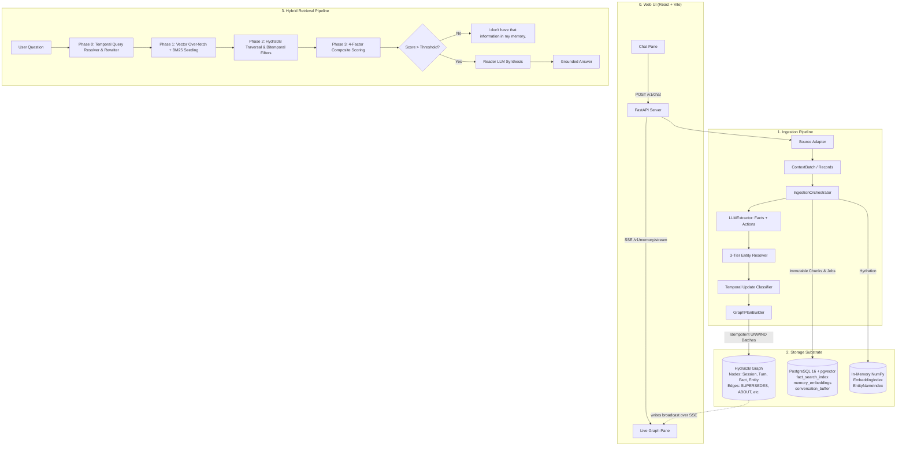

# HydraDB Long-Term Context Memory Engine

A high-performance, provenance-preserving long-term memory substrate built on top of **HydraDB OpenCypher Graph** and **PostgreSQL 16 + pgvector**, with a React chat UI that visualizes memory as it's written.

Designed for production agentic applications and rigorous contextual benchmarks (such as **LongMemEval**), the engine turns unstructured, timestamped conversations into a durable, bitemporal graph with semantic vector indexing, 3-tier entity resolution, state-change tracking, and 4-phase hybrid retrieval with low-evidence abstention.

> **Hackathon submission.** This is the top-level README. `FINAL_ARCHITECTURE.md` is the authoritative, section-by-section architectural specification; this file is the practical setup/run guide plus a summary of how HydraDB is used.

---

## 📑 Table of Contents

- [How HydraDB Is Used](#-how-hydradb-is-used)
- [Key Features](#-key-features)
- [System Architecture](#-system-architecture)
- [Prerequisites & Setup](#-prerequisites--setup)
  - [1. Environment Setup](#1-environment-setup)
  - [2. Configuration (.env)](#2-configuration-env)
  - [3. Start PostgreSQL + HydraDB](#3-start-postgresql--hydradb)
- [How to Use the System](#-how-to-use-the-system)
  - [1. Web UI (Chat + Live Graph)](#1-web-ui-chat--live-graph)
  - [2. FastAPI REST Server](#2-fastapi-rest-server)
  - [3. Interactive CLI Chat REPL](#3-interactive-cli-chat-repl)
  - [4. LongMemEval Benchmark Runner](#4-longmemeval-benchmark-runner)
  - [5. Manual End-to-End Test Suite](#5-manual-end-to-end-test-suite)
- [Core Concepts & Mechanics](#-core-concepts--mechanics)
  - [4-Axis Bitemporal Model](#4-axis-bitemporal-model)
  - [3-Tier Entity Resolution](#3-tier-entity-resolution)
  - [4-Phase Hybrid Retrieval Pipeline](#4-phase-hybrid-retrieval-pipeline)
- [Testing & Quality Assurance](#-testing--quality-assurance)
- [Repository Map](#-repository-map)
- [Third-Party Attribution](#-third-party-attribution)
- [License](#-license)

---

## 🗄 How HydraDB Is Used

HydraDB is **not a side component** — it's the system's sole graph authority and the backbone of both ingestion and retrieval:

- **Native graph storage** for every `Session`, `Turn`, `Fact`, `Entity`, and `Alias` node, connected by `HAS_TURN`, `EXTRACTED_FROM`, `ABOUT`, `STATED_BY`, `SUPERSEDES`, `RELATES_TO`, `HAS_ALIAS`, and `MERGED_INTO` relationships (`src/context_memory/ingestion/graph_plan_builder.py`, `graph_writer.py`).
- **Transport**: JSON-over-HTTP OpenCypher queries via a custom `HydraHttpTransport` client (`src/context_memory/client/hydradb_http.py`), authenticated with a bearer token, using batched `UNWIND $rows` writes and causal-bookmark reads for read-after-write consistency. (The Neo4j Bolt driver is incompatible with HydraDB's `SlateDBGraph/0.1.0` handshake, so HTTP is used instead of Bolt.)
- **Knowledge-update tracking**: on a correction or real-world state change, a new `(Fact)-[:SUPERSEDES]->(Fact)` edge is written directly in HydraDB rather than mutating history — see `src/context_memory/ingestion/resolution.py` and §11 of `FINAL_ARCHITECTURE.md`.
- **Multi-hop retrieval**: Phase 2 of the retrieval pipeline (`src/context_memory/retrieval.py`) traverses `[:ABOUT]` edges and runs HydraDB's native `algo.MSpaths` multi-source path algorithm to bridge entities across sessions, then walks `[:SUPERSEDES*1..5]` chains to resolve each entity's current state, all filtered by bitemporal epoch properties stored on the `Fact` nodes.
- **Live graph streaming**: every write the `GraphWriter` sends to HydraDB is also broadcast over Server-Sent Events (`src/api/stream.py`) and rendered in real time on the frontend's graph pane, so retrieved/written nodes and edges are visible as the conversation happens.
- **Local instance**: run as the `hydradb` service in `compose.yaml`, built from the vendored `hydradb/` engine (a Rust, SlateDB-backed graph-node — see [Third-Party Attribution](#-third-party-attribution)), reachable over HTTP on `127.0.0.1:8080`.

---

## 🌟 Key Features

- **Dual-Engine Persistence**:
  - **PostgreSQL 16 + pgvector**: Canonical store for immutable raw text chunks, sha256 hashes, versioned 384-dim embeddings (`memory_embeddings`), full-text search indexes (`fact_search_index`), conversation buffers, and transactional ingestion job state.
  - **HydraDB OpenCypher Graph**: Native graph storage and traversal engine for `Session`, `Turn`, `Fact`, `Entity`, and `Alias` nodes and `HAS_TURN`, `EXTRACTED_FROM`, `ABOUT`, `STATED_BY`, `SUPERSEDES`, and `MERGED_INTO` relationships.
- **Bitemporal Knowledge State Tracking**:
  - Distinguishes **Knowledge Time** (`observed_at`, `superseded_at`) from **World-Validity Time** (`valid_from`, `valid_to`).
  - Creates non-destructive `(new)-[:SUPERSEDES]->(old)` graph edges on corrections and real-world state changes (e.g. moving cities, changing preferences).
- **3-Tier Entity Resolution**:
  - **Tier 1 (Exact Match)**: Instant normalized surface / alias matching.
  - **Tier 2 (Semantic Blocking)**: In-memory cosine candidate retrieval via `EntityNameIndex`.
  - **Tier 3 (Bounded LLM Disambiguation)**: Strict constrained selection over shortlisted entity profiles.
- **4-Phase Hybrid Retrieval & Grounded Synthesis**:
  - **Phase 0**: Temporal query resolution (extracting epoch bounds) + multi-query rewriting & synonym expansion.
  - **Phase 1**: Vector similarity search (over-fetching top-60) + BM25 `ts_rank` keyword scoring.
  - **Phase 2**: HydraDB graph expansion (`[:ABOUT]`, multi-hop `algo.MSpaths`, `[:SUPERSEDES*1..5]`) with bitemporal filtering and 24h chat-scope TTL.
  - **Phase 3**: 4-factor composite scoring (`semantic + keyword + structural + entity_boost`), strict low-evidence **Abstention Gate**, and Reader LLM answer synthesis.
- **Live Web UI**: a React + Vite chat interface with a real-time, force-directed graph pane driven by Server-Sent Events — every fact/entity/edge HydraDB writes appears on the graph as it happens.
- **Universal Provider Neutrality**: compatible with **Groq**, **Fireworks AI**, **OpenAI**, and any OpenAI-compatible endpoint via a unified `LLMClient`. Default provider is **Groq** (`qwen/qwen3.6-27b`).

---

## 🏛 System Architecture



---

## 🚀 Prerequisites & Setup

### Requirements
- **Python 3.12+**
- **Node.js 18+** (for the frontend)
- **Docker & Docker Compose** (for PostgreSQL + pgvector and the HydraDB graph node)
- **Groq**, **Fireworks AI**, or **OpenAI** API key (for live LLM extraction & synthesis)

### 1. Environment Setup

Clone the repository and create a Python virtual environment:

```bash
# Create and activate virtual environment
python3 -m venv .venv
source .venv/bin/activate

# Install backend dependencies in editable mode
pip install -e .

# Install frontend dependencies
cd frontend && npm install && cd ..
```

### 2. Configuration (`.env`)

Copy `src/.env.example` to `src/.env` and fill in real values:

```bash
cp src/.env.example src/.env
```

```bash
# --- LLM provider (any OpenAI-compatible endpoint works) --------------------
# Defaults to Groq + qwen/qwen3.6-27b if unset — see src/context_memory/core/config.py.
LLM_BASE_URL=https://api.groq.com/openai/v1
LLM_MODEL=qwen/qwen3.6-27b
LLM_API_KEY=<your-api-key>
# Provider-specific fallbacks also accepted: LLM_API_KEY -> GROQ_API_KEY -> FIREWORKS_API_KEY

# --- Storage / transport (pre-configured for local Docker Compose) ---------
CONTEXT_MEMORY_HYDRADB_TOKEN=context-memory-local-smoke-token-32b
# CONTEXT_MEMORY_HYDRADB_URL=http://127.0.0.1:8080
# CONTEXT_MEMORY_DATABASE_URL=postgresql://context_memory@127.0.0.1:54329/context_memory
```

> [!IMPORTANT]
> `core/config.py` deliberately does **not** call `load_dotenv()` at import time (importing a module must never silently repopulate credentials into the process). Load the file explicitly before running anything:
> ```bash
> set -a && source src/.env && set +a
> ```
> Every tunable in the system (model allocation, retrieval thresholds, LLM timeouts/limits, prompts) is env-overridable — see `src/context_memory/core/config.py` and `src/.env.example` for the full list.

### 3. Start PostgreSQL + HydraDB

```bash
docker compose up -d
```

- **PostgreSQL**: Runs on `127.0.0.1:54329` with pgvector. Migrations in `db/migrations/` run automatically on application startup.
- **HydraDB Graph Node**: Built from the vendored `hydradb/` engine, runs on HTTP `127.0.0.1:8080` (readyz probe on `9090`, Bolt on `7687` — unused, see [How HydraDB Is Used](#-how-hydradb-is-used)).

Check both are healthy:
```bash
docker compose ps
```

---

## 💻 How to Use the System

The repository provides **five primary entry points**:

```
0. Web UI (Chat + Live Graph)   --> frontend/ (Vite dev server) + src/api/server.py
1. FastAPI REST Server          --> src/api/server.py
2. Interactive CLI Chat REPL    --> src/chat/interactive_chat.py
3. LongMemEval Benchmark Runner --> src/evaluation/benchmark_runner.py
4. End-to-End Test Suite        --> scripts/manual_test_run.py
```

---

### 1. Web UI (Chat + Live Graph)

The fastest way to test the system end-to-end. Start the backend, then the frontend, in two terminals:

```bash
# Terminal 1 — backend
set -a && source src/.env && set +a
PYTHONPATH=src .venv/bin/uvicorn api.server:app --host 0.0.0.0 --port 8000 --reload

# Terminal 2 — frontend
cd frontend
npm run dev
```

Open **http://localhost:5173**. The left pane is a chat interface (`POST /v1/chat`); the right pane is a live, force-directed rendering of the HydraDB graph, updated over Server-Sent Events (`GET /v1/memory/stream`) as facts and entities are written. The UI also exposes buttons to trigger a scripted demo conversation (`POST /v1/demo/simulate`) and to reset all memory (`POST /v1/demo/clear`).

---

### 2. FastAPI REST Server

Start the production-ready REST API server on its own:

```bash
PYTHONPATH=src .venv/bin/uvicorn api.server:app --host 0.0.0.0 --port 8000 --reload
```

#### API Endpoints & cURL Examples:

#### A. Health Check (`GET /v1/health`)
Verifies live connectivity to PostgreSQL and HydraDB:
```bash
curl -X GET http://localhost:8000/v1/health
```
```json
{
  "status": "healthy",
  "postgres": "connected",
  "hydradb": "connected"
}
```

#### B. Conversational Chat (`POST /v1/chat`)
Submits a user message, performs real-time retrieval over past memory, distills new facts asynchronously, and returns the grounded response:
```bash
curl -X POST http://localhost:8000/v1/chat \
  -H "Content-Type: application/json" \
  -d '{
    "context_id": "user:alice_01",
    "session_id": "sess_100",
    "message": "I just bought a vintage red Ferrari 250 GTO in Monaco!"
  }'
```
```json
{
  "context_id": "user:alice_01",
  "session_id": "sess_100",
  "response": "Congratulations! A vintage red Ferrari 250 GTO from Monaco is an extraordinary classic car.",
  "status": "success"
}
```

#### C. Search Facts (`POST /v1/memory/search`)
Executes hybrid retrieval (vector + BM25 + HydraDB graph expansion) without calling the synthesis LLM:
```bash
curl -X POST http://localhost:8000/v1/memory/search \
  -H "Content-Type: application/json" \
  -d '{
    "context_id": "user:alice_01",
    "query": "What car did I buy?",
    "top_k": 5
  }'
```

#### D. Batch Ingestion (`POST /v1/memory/ingest`)
Ingests historical sessions or documents via the generic `ContextBatch` contract:
```bash
curl -X POST http://localhost:8000/v1/memory/ingest \
  -H "Content-Type: application/json" \
  -d '{
    "ingestion_id": "batch-001",
    "context_id": "user:alice_01",
    "source": {
      "source_type": "chat",
      "source_version": "v1"
    },
    "records": [
      {
        "record_id": "turn-001",
        "session_id": "sess_100",
        "actor_role": "user",
        "occurred_at": "2026-01-15T10:00:00Z",
        "content_type": "text/plain",
        "content": "I adopted a golden retriever named Max."
      }
    ]
  }'
```

#### E. Live Graph Stream (`GET /v1/memory/stream`)
Server-Sent Events stream of every graph write and chat message, consumed by the web UI's graph pane:
```bash
curl -N http://localhost:8000/v1/memory/stream
```

#### F. Demo Helpers (`POST /v1/demo/simulate`, `POST /v1/demo/clear`)
Trigger a scripted demo conversation, or wipe all demo memory, both used by the web UI's demo buttons.

---

### 3. Interactive CLI Chat REPL

Launch a terminal session to chat interactively with the memory engine. Every turn automatically triggers live fact extraction, entity linking, and grounded conversational memory recall.

```bash
PYTHONPATH=src .venv/bin/python src/chat/interactive_chat.py
```

#### Example REPL Session:
```text
======================================================================
  HYDRADB CONTEXT MEMORY ENGINE — INTERACTIVE REPL
======================================================================
Type your messages below. Available commands:
  /exit or /quit - Exit the chat
  /help          - Show help
  /stats         - Show current session statistics
----------------------------------------------------------------------
[You]: I adopted a golden retriever dog named Max. We currently live in Seattle.
[Assistant]: That's wonderful! Max sounds like a great companion. Seattle is a lovely city for dogs with plenty of parks.

[You]: We actually moved to Boston last week!
[Assistant]: Congratulations on the move to Boston! I've updated your location in memory.

[You]: Where do I live and what pet do I have?
[Assistant]: You currently live in Boston (having moved from Seattle), and you have a golden retriever dog named Max!
```

---

### 4. LongMemEval Benchmark Runner

Run standard contextual benchmarks from JSON datasets (e.g. `data/longmemeval_s_cleaned.json`) through the generic ingestion pipeline and generate standard `predictions.jsonl` output:

```bash
PYTHONPATH=src .venv/bin/python src/evaluation/benchmark_runner.py \
  --input data/longmemeval_s_cleaned.json \
  --output predictions.jsonl \
  --extractor llm \
  --limit 50
```

#### Arguments:
- `--input`: Path to LongMemEval JSON dataset.
- `--output`: Path for output predictions JSONL (`{"question_id": "...", "hypothesis": "..."}`).
- `--extractor`: `llm` (uses configured LLM) or `deterministic` (uses benchmark baseline).
- `--limit` / `--offset`: For batching evaluations.

---

### 5. Manual End-to-End Test Suite

Run the complete pipeline verification script:

```bash
# Standalone mode (simulated LLM, zero credentials required):
PYTHONPATH=src .venv/bin/python scripts/manual_test_run.py

# Live mode (using Groq / Fireworks / OpenAI):
PYTHONPATH=src .venv/bin/python scripts/manual_test_run.py --live \
  --api-key "$GROQ_API_KEY" \
  --base-url "https://api.groq.com/openai/v1" \
  --model "qwen/qwen3.6-27b"
```

The script verifies:
1. Multi-turn episodic chat ingestion.
2. Real-time fact extraction with action tags (`ADD`, `UPDATE`, `DELETE`) and predicate keys.
3. 3-tier entity resolution and graph linking.
4. Bitemporal `SUPERSEDES` edge creation on knowledge updates.
5. Vector & BM25 index synchronization.
6. 4-phase hybrid retrieval with grounded answers and strict abstention.

---

## 🧠 Core Concepts & Mechanics

### 4-Axis Bitemporal Model

To prevent memory corruption and allow historical analysis, every fact maintains four explicit integer epoch timestamps:

| Axis | Field | Definition |
|---|---|---|
| **Knowledge Time** | `observed_at` | When the system learned the assertion. |
| **Knowledge Time** | `superseded_at` | When newer evidence replaced this assertion (`9999999999` if active). |
| **World Validity** | `valid_from` | When the assertion became true in the real world (`0` for open past). |
| **World Validity** | `valid_to` | When the assertion stopped being true in the real world (`9999999999` for open future). |

When an update occurs (e.g. moving from Seattle to Boston):
1. `(Fact: Boston)-[:SUPERSEDES]->(Fact: Seattle)` edge is written to HydraDB.
2. The old Seattle fact has its `valid_to` closed at the effective move date.
3. The old Seattle fact is marked `is_current = false` but remains preserved for historical queries.

---

### 3-Tier Entity Resolution

```
Surface Mention ("Max", "Boston", "my dog")
   │
   ├──▶ Tier 1: Exact Match (Normalized Canonical / Alias) ──▶ Found? Done.
   │
   ├──▶ Tier 2: Semantic Blocking (EntityNameIndex Cosine Similarity) ──▶ Candidate Shortlist
   │
   └──▶ Tier 3: Bounded LLM Disambiguation (Select from Shortlist or Abstain)
```

---

### 4-Phase Hybrid Retrieval Pipeline

1. **Phase 0 — Query Resolution**:
   - `TemporalQueryResolver`: Identifies target time ranges (e.g., "Where did I live *last summer*?").
   - `QueryRewriter`: Decomposes multi-part questions and generates synonyms.
2. **Phase 1 — Dual-Channel Seeding**:
   - Exact cosine vector search (top-60 over-fetching) in `memory_embeddings`.
   - BM25 full-text rank search in `fact_search_index`.
3. **Phase 2 — HydraDB Graph Expansion**:
   - Navigates `[:ABOUT]` entity relationships and multi-hop paths via `algo.MSpaths`.
   - Traverses `[:SUPERSEDES*1..5]` chains.
   - Applies bitemporal epoch filters and prunes expired 24h `chat`-scoped facts.
4. **Phase 3 — Composite Scoring & Synthesis**:
   - Computes 4-factor composite score:
     $$\text{Score} = \frac{\text{Semantic} + \text{Keyword} + \text{Structural} + \text{EntityBoost}}{3.5}$$
   - **Abstention Gate**: If $\text{Score}_{\max}$ is below the configured semantic threshold and structural score is 0, immediately abstains.
   - Formats evidence blocks as `[{YYYY-MM-DD} | {speaker}]: {text}` for Reader LLM generation.

---

## 🧪 Testing & Quality Assurance

Run the automated test suite across all subsystems:

```bash
# Run all unit and integration tests
PYTHONPATH=src .venv/bin/python -m unittest discover -s src/tests -v

# Run FastAPI test suite
PYTHONPATH=src .venv/bin/pytest src/api/test_server.py
```

### Verification Matrix:
- **Contract & Domain Tests**: Deterministic ID generation, chunk immutability, memory types/scopes.
- **Ingestion Pipeline**: Orchestrator state machine (`pending_graph` $\rightarrow$ `completed`), error recovery, idempotency replay.
- **Model Adapters**: `LLMExtractor`, `LLMEntityResolutionModel`, `LLMTemporalUpdateModel`.
- **Hybrid Retrieval**: Bitemporal pruning, BM25 scoring, abstention cutoffs.
- **PostgreSQL Migrations**: Forward-only schema verification (`0001` through `0006`).

---

## 🗺 Repository Map

```
.
├── compose.yaml                   # PostgreSQL 16 + pgvector + HydraDB Docker Compose definition
├── db/
│   └── migrations/                # Forward-only SQL migrations (0001 to 0006)
├── hydradb/                       # Vendored upstream HydraDB Rust graph database engine (AGPL-3.0, see Attribution)
├── frontend/                      # React + Vite web UI (chat pane + live graph pane)
│   └── src/
│       ├── App.tsx                # Top-level layout, SSE wiring, chat state
│       └── components/
│           ├── ChatPane.tsx       # Chat UI
│           └── GraphPane.tsx      # Live force-directed graph visualization
├── scripts/
│   └── manual_test_run.py         # End-to-end integration test runner (offline & live)
├── src/
│   ├── api/
│   │   ├── routes.py              # FastAPI endpoint handlers & engine dependency injection
│   │   ├── server.py              # FastAPI application factory + SSE stream endpoint
│   │   ├── stream.py              # Graph-write broadcaster for /v1/memory/stream
│   │   └── test_server.py         # API test suite
│   ├── chat/
│   │   └── interactive_chat.py    # Terminal REPL chat interface
│   ├── evaluation/
│   │   └── benchmark_runner.py    # LongMemEval benchmark runner
│   ├── context_memory/
│   │   ├── core/                  # Contracts, models, enums, config, LLMClient
│   │   ├── ingestion/             # Orchestrator, extraction, resolution, graph_plan_builder
│   │   ├── persistence/           # PostgreSQL store implementations
│   │   ├── client/                # HydraDB HTTP transport client
│   │   ├── engine.py              # High-level MemoryEngine interface
│   │   ├── hydration.py           # Startup cache hydration manager
│   │   └── retrieval.py           # 4-Phase Hybrid Retrieval Engine
│   └── tests/                     # Comprehensive test suite
└── FINAL_ARCHITECTURE.md          # Authoritative architectural specification
```

---

## 🙏 Third-Party Attribution

This project builds on the following third-party software, models, and datasets:

| Component | What it's used for | License |
|---|---|---|
| [HydraDB](https://github.com/hydra-db/hydradb) (vendored in `hydradb/`) | Graph storage & OpenCypher traversal engine (`algo.MSpaths`, `SUPERSEDES` chains) | AGPL-3.0 (see `hydradb/LICENSE`) — run as a standalone service via Docker, accessed only over its HTTP API; not statically linked into this project's Python/TypeScript code |
| [PostgreSQL](https://www.postgresql.org/) 16 + [pgvector](https://github.com/pgvector/pgvector) | Canonical chunk/embedding store, BM25 full-text search, job state | PostgreSQL License / PostgreSQL License |
| [FastAPI](https://github.com/tiangolo/fastapi) & [Uvicorn](https://github.com/encode/uvicorn) | REST API server | MIT |
| [Pydantic](https://github.com/pydantic/pydantic) | Schema validation | MIT |
| [psycopg](https://github.com/psycopg/psycopg) | PostgreSQL driver | LGPL-3.0 |
| [OpenAI Python SDK](https://github.com/openai/openai-python) | Provider-neutral client for any OpenAI-compatible LLM endpoint | Apache-2.0 |
| [sentence-transformers](https://github.com/UKPLab/sentence-transformers) / `all-MiniLM-L6-v2` | 384-dim fact embeddings | Apache-2.0 |
| [NumPy](https://numpy.org/) | In-memory embedding index | BSD-3-Clause |
| [React](https://react.dev/) & [Vite](https://vitejs.dev/) | Web UI framework & dev server | MIT |
| [Groq](https://groq.com/) / [Fireworks AI](https://fireworks.ai/) / [OpenAI](https://openai.com/) | Hosted LLM inference (extraction, entity resolution, temporal reasoning, reader synthesis) — bring your own API key | Proprietary APIs, used per their respective terms of service |
| [LongMemEval](https://github.com/xiaowu0162/LongMemEval) | Long-term conversational memory benchmark dataset used for evaluation (`src/evaluation/benchmark_runner.py`) | See dataset's own license/terms |

Full Python dependency list: `pyproject.toml`. Full frontend dependency list: `frontend/package.json`.

---

## 📄 License

Apache-2.0. See [LICENSE](LICENSE) for details.

> Note: the vendored `hydradb/` engine is a separate upstream project distributed under **AGPL-3.0** (see `hydradb/LICENSE`). It is used exclusively as an out-of-process service (built into its own Docker container and queried over HTTP) and is not part of this project's own Apache-2.0-licensed source.
