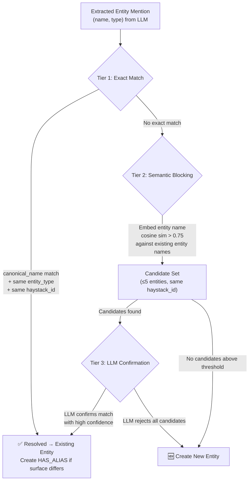

# Entity Resolution Strategy — Co-reference & Deduplication

Follow-up to [graph_schema_proposal.md](file:///home/aryan-sherigar/projects/hydradb-hackathon/docs/graph_schema_proposal.md) and [semantic_memory_distillation.md](file:///home/aryan-sherigar/projects/hydradb-hackathon/docs/semantic_memory_distillation.md).

---

## 1. Problem Statement

During ingestion, the extractor LLM produces entity mentions from conversational turns. The same real-world entity can appear under many surface forms across sessions:

| Session | Turn text | Extractor output |
|---|---|---|
| `session_001` | *"I adopted a golden retriever named Max."* | `entity_name: "Max", entity_type: "pet"` |
| `session_005` | *"My dog is feeling sick."* | `entity_name: "my dog", entity_type: "pet"` |
| `session_012` | *"I took the golden retriever to the vet."* | `entity_name: "the golden retriever", entity_type: "pet"` |

All three refer to the same `Entity(name="Max", type="pet")`. Without resolution, each creates a separate disconnected entity node, fragmenting fact retrieval and breaking multi-session graph traversal.

---

## 2. Design Decisions (Confirmed)

| Decision | Choice | Rationale |
|---|---|---|
| **Extractor context window** | Current session + top-K existing facts from `EmbeddingIndex` | Reuses the distillation pipeline's candidate retrieval. The LLM sees existing entity names in the candidates, enabling inline co-reference. |
| **Merge confidence** | Conservative — exact `canonical_name` match or LLM-confirmed high confidence | Avoids false merges (e.g., "Max" the dog ≠ "Max" the colleague). Cheaper to create an extra entity and merge later than to fix a wrong merge. |
| **Reversibility** | Yes — `MERGED_INTO` audit edge in HydraDB | HydraDB supports directed relationship creation and `DETACH DELETE`, which enables undo. Soft-delete with an audit trail preserves graph integrity. |
| **Haystack isolation** | Entities are always scoped by `haystack_id` — no cross-haystack merging | Works for both global ingestion and per-question ingestion. Two haystacks with unrelated "Max" entities never interfere. |
| **LLM cost model** | Moderate — batch entity confirmation calls (~1 call per turn with all candidate pairs) | Amortizes cost by packing multiple candidate pairs into one LLM call instead of one call per pair. |

---

## 3. Three-Tier Resolution Algorithm

Entity resolution runs as part of the ingestion pipeline, after fact extraction and before graph writes. It uses a **blocking → matching → merging** pattern borrowed from production entity resolution systems.



### Tier 1: Deterministic Exact Match (Zero LLM cost)

Normalize the extracted `entity_name` to a canonical form (lowercase, strip articles/possessives, collapse whitespace) and check for an exact match against:

1. `Entity.canonical_name` in the current `haystack_id`
2. `Alias.canonical_alias` in the current `haystack_id`

```python
def canonicalize(name: str) -> str:
    """Normalize entity name for deterministic matching."""
    name = name.lower().strip()
    # Strip common articles and possessives
    for prefix in ["my ", "the ", "a ", "an ", "our ", "his ", "her ", "their "]:
        if name.startswith(prefix):
            name = name[len(prefix):]
    # Collapse whitespace
    name = " ".join(name.split())
    return name
```

**HydraDB Lookup**:
```cypher
MATCH (e:Entity {canonical_name: $canonical, haystack_id: $hid})
RETURN e.id AS entity_id, e.name AS name, e.entity_type AS entity_type
```

If no match on `Entity.canonical_name`, check aliases:
```cypher
MATCH (a:Alias {canonical_alias: $canonical, haystack_id: $hid})<-[:HAS_ALIAS]-(e:Entity {haystack_id: $hid})
RETURN e.id AS entity_id, e.name AS name, e.entity_type AS entity_type
```

**If matched**: Use the existing `Entity.id`. If the raw surface form differs from the matched name/alias, create a new `Alias` node:
```cypher
CREATE (e:Entity {id: $entity_id})-[:HAS_ALIAS]->(a:Alias {id: $alias_id, haystack_id: $hid, alias: $surface_form, canonical_alias: $canonical})
```

**Expected hit rate**: ~60-70% of entity mentions resolve here (same name used repeatedly, or trivial normalization like "Max" → "max").

---

### Tier 2: Semantic Blocking (Zero LLM cost, uses existing embedding infrastructure)

For unresolved mentions, compute an embedding of the entity name using the same `all-MiniLM-L6-v2` model already loaded in-process. Compare against a lightweight **entity name embedding index** (separate from the fact embedding index — ~500 entity names × 384 dims = 0.7 MB).

```python
class EntityNameIndex:
    """Lightweight in-process index over entity names for semantic blocking."""
    
    def __init__(self, model):
        self.model = model  # shared SentenceTransformer instance
        self._embeddings: dict[int, np.ndarray] = {}   # entity_id → embedding
        self._haystacks: dict[int, str] = {}            # entity_id → haystack_id
        self._types: dict[int, str] = {}                # entity_id → entity_type
        self._names: dict[int, str] = {}                # entity_id → display name
    
    def add(self, entity_id: int, name: str, entity_type: str, haystack_id: str):
        vec = self.model.encode(name, normalize_embeddings=True)
        self._embeddings[entity_id] = vec
        self._haystacks[entity_id] = haystack_id
        self._types[entity_id] = entity_type
        self._names[entity_id] = name
    
    def find_candidates(self, query_name: str, entity_type: str, haystack_id: str,
                        top_k: int = 5, threshold: float = 0.75) -> list[dict]:
        """Return top-K entity candidates above similarity threshold, filtered by haystack_id."""
        query_vec = self.model.encode(query_name, normalize_embeddings=True)
        
        candidates = []
        for eid, vec in self._embeddings.items():
            if self._haystacks[eid] != haystack_id:
                continue
            sim = float(np.dot(query_vec, vec))
            if sim >= threshold:
                candidates.append({
                    "entity_id": eid,
                    "name": self._names[eid],
                    "entity_type": self._types[eid],
                    "similarity": sim,
                    "type_match": self._types[eid] == entity_type
                })
        
        # Sort by: type_match (True first), then similarity descending
        candidates.sort(key=lambda c: (-c["type_match"], -c["similarity"]))
        return candidates[:top_k]
```

**Blocking criteria**:
- Cosine similarity ≥ 0.75
- Same `haystack_id`
- Candidates are returned sorted by `entity_type` match (same type ranked higher) then similarity

**If zero candidates**: Create a new entity. Skip Tier 3.

**If candidates found**: Pass to Tier 3.

---

### Tier 3: Batched LLM Confirmation (One LLM call per turn, not per pair)

The key cost optimization: **batch all unresolved entity mentions from a single turn into one LLM call**, along with their candidate sets. This amortizes the LLM cost to ~1 call per turn (worst case), not 1 call per entity-pair comparison.

#### Prompt Design

```
System: You are an entity resolution judge. Given a set of newly extracted entity
mentions and their candidate matches from an existing knowledge graph, determine
whether each new mention refers to an existing entity or is a genuinely new entity.

Consider:
- Entity type compatibility (a "pet" named "Max" is different from a "person" named "Max")
- Conversational context (the surrounding fact text)
- Alias plausibility ("my dog" is a plausible alias for a pet named "Max")

For each mention, respond with either:
- MATCH: <entity_id> — if the mention refers to an existing entity
- NEW — if this is a genuinely distinct entity

Respond in the JSON format specified.
```

#### Pydantic Schema

```python
class EntityResolutionDecision(BaseModel):
    mention_index: int = Field(description="Index of the mention in the input list")
    decision: Literal["MATCH", "NEW"]
    matched_entity_id: int | None = Field(
        default=None,
        description="ID of the matched existing entity (only when decision is MATCH)"
    )
    confidence: Literal["high", "medium", "low"]
    reasoning: str = Field(description="Brief explanation of why this decision was made")

class EntityResolutionBatch(BaseModel):
    decisions: list[EntityResolutionDecision]
```

#### Input Format (sent to LLM)

```json
{
  "context_turn": "My dog is feeling sick today, I need to find a vet.",
  "unresolved_mentions": [
    {
      "index": 0,
      "extracted_name": "my dog",
      "extracted_type": "pet",
      "fact_text": "User's dog is feeling sick",
      "candidates": [
        {"entity_id": 2000, "name": "Max", "type": "pet", "similarity": 0.82},
        {"entity_id": 2045, "name": "Buddy", "type": "pet", "similarity": 0.78}
      ]
    }
  ]
}
```

#### Decision Logic

| LLM Response | Action |
|---|---|
| `MATCH` + `confidence: "high"` | Resolve to existing entity. Create `HAS_ALIAS` for the new surface form. |
| `MATCH` + `confidence: "medium"` | Resolve to existing entity. Create `HAS_ALIAS`. Log for optional human review. |
| `MATCH` + `confidence: "low"` | **Reject match** — treat as `NEW`. Conservative strategy: low-confidence matches are too risky. |
| `NEW` | Create a new `Entity` node. |

> [!IMPORTANT]
> Low-confidence matches are treated as `NEW` per our conservative merge strategy. It is cheaper and safer to create an extra entity and merge it later (via the batch dedup sweep or manual review) than to pollute the graph with a false merge.

---

## 4. Reversible Merge — `MERGED_INTO` Audit Trail

### New Relationship Type: `MERGED_INTO`

When a merge is performed (whether during ingestion or a later dedup sweep), the source entity is **not deleted**. Instead:

1. A `MERGED_INTO` edge is created from the source entity to the target (surviving) entity.
2. All `ABOUT` edges from facts pointing to the source entity are **re-pointed** to the target entity.
3. All `HAS_ALIAS` edges from the source entity are **re-pointed** to the target entity.
4. The source entity is marked inactive: `SET source.is_merged = true`.

```
MERGED_INTO   Entity → Entity   (source was merged into target)
```

#### Properties on `MERGED_INTO`

| Property | Type | Purpose |
|---|---|---|
| `merged_at` | `int` | Epoch timestamp of the merge |
| `merge_reason` | `string` | `"exact_match"`, `"llm_confirmed"`, or `"manual"` |
| `confidence` | `string` | `"high"` or `"medium"` (from LLM) or `"deterministic"` (from Tier 1) |

#### HydraDB Cypher for Merge

**Step 1 — Create audit edge**:
```cypher
CREATE (source:Entity {id: $source_id})-[:MERGED_INTO {merged_at: $ts, merge_reason: $reason, confidence: $conf}]->(target:Entity {id: $target_id})
```

**Step 2 — Mark source inactive**:
```cypher
MATCH (source:Entity {id: $source_id, haystack_id: $hid})
SET source.is_merged = true
```

**Step 3 — Re-point ABOUT edges** (done per-fact, since HydraDB requires one statement per request):
```cypher
MATCH (f:Fact {id: $fact_id, haystack_id: $hid})-[r:ABOUT]->(source:Entity {id: $source_id, haystack_id: $hid})
DELETE r
```
```cypher
MATCH (f:Fact {id: $fact_id, haystack_id: $hid}), (target:Entity {id: $target_id, haystack_id: $hid})
CREATE (f)-[:ABOUT]->(target)
```

**Step 4 — Migrate aliases** (per-alias):
```cypher
MATCH (source:Entity {id: $source_id, haystack_id: $hid})-[r:HAS_ALIAS]->(a:Alias {id: $alias_id})
DELETE r
```
```cypher
MATCH (target:Entity {id: $target_id, haystack_id: $hid}), (a:Alias {id: $alias_id, haystack_id: $hid})
CREATE (target)-[:HAS_ALIAS]->(a)
```

> [!NOTE]
> HydraDB executes one statement per request, so the merge is a multi-step sequential operation. At our scale (~500 entities per haystack, merges are rare), this sequential cost is negligible. Each step is individually durable (writes commit to object storage on return), so a crash mid-merge leaves a partially-migrated but consistent state that can be detected and resumed.

#### Undo a Merge

To reverse a merge, follow the `MERGED_INTO` audit edge and reverse each step:

```cypher
MATCH (source:Entity {id: $source_id, haystack_id: $hid})-[m:MERGED_INTO]->(target:Entity {id: $target_id, haystack_id: $hid})
RETURN m.merged_at AS merged_at
```

Then re-point facts and aliases back to the source entity (reverse of Step 3/4), remove the `MERGED_INTO` edge, and set `source.is_merged = false`.

---

## 5. Schema Additions

### New to `graph_schema_proposal.md`

**Node property addition**:

| Node | Property | Type | Purpose |
|---|---|---|---|
| **Entity** | `is_merged` | `boolean` | `true` if this entity was merged into another. Default `false`. |

**New relationship type**:

| Relationship | From → To | Properties | Purpose |
|---|---|---|---|
| `MERGED_INTO` | Entity → Entity | `merged_at` (int), `merge_reason` (string), `confidence` (string) | Audit trail for entity merges. Source entity is inactive. |

**New in-process index**:

| Index | Storage | Join Key | Purpose |
|---|---|---|---|
| `EntityNameIndex` | In-process Python dict + numpy | `Entity.id` | Semantic blocking for Tier 2 candidate retrieval |

---

## 6. Integration with Distillation Pipeline

The entity resolution step slots into the `_apply_memory_action` method from [semantic_memory_distillation.md](file:///home/aryan-sherigar/projects/hydradb-hackathon/docs/semantic_memory_distillation.md):

```python
class EntityResolver:
    def __init__(self, driver, entity_name_index, llm, id_gen):
        self.driver = driver
        self.index = entity_name_index
        self.llm = llm
        self.id_gen = id_gen

    def resolve_entities_for_turn(
        self,
        extracted_memories: list[ExtractedMemory],
        turn_content: str,
        haystack_id: str,
    ) -> dict[int, int]:
        """
        Resolve all entity mentions from a single turn.
        Returns: {mention_index → resolved_entity_id}
        """
        resolutions: dict[int, int] = {}
        unresolved: list[tuple[int, ExtractedMemory, list[dict]]] = []

        for idx, mem in enumerate(extracted_memories):
            canonical = canonicalize(mem.entity_name)
            
            # ---- Tier 1: Exact match ----
            entity_id = self._exact_match(canonical, haystack_id)
            if entity_id is not None:
                resolutions[idx] = entity_id
                self._maybe_create_alias(entity_id, mem.entity_name, canonical, haystack_id)
                continue
            
            # ---- Tier 2: Semantic blocking ----
            candidates = self.index.find_candidates(
                query_name=mem.entity_name,
                entity_type=mem.entity_type,
                haystack_id=haystack_id,
                top_k=5,
                threshold=0.75,
            )
            if not candidates:
                # No candidates → new entity
                new_id = self._create_entity(mem, haystack_id)
                resolutions[idx] = new_id
                continue
            
            # Defer to Tier 3 batch
            unresolved.append((idx, mem, candidates))

        # ---- Tier 3: Batched LLM confirmation ----
        if unresolved:
            llm_decisions = self._batched_llm_resolve(unresolved, turn_content, haystack_id)
            for idx, decision in llm_decisions.items():
                if decision.decision == "MATCH" and decision.confidence != "low":
                    resolutions[idx] = decision.matched_entity_id
                    mem = extracted_memories[idx]
                    self._maybe_create_alias(
                        decision.matched_entity_id, mem.entity_name,
                        canonicalize(mem.entity_name), haystack_id
                    )
                else:
                    mem = extracted_memories[idx]
                    new_id = self._create_entity(mem, haystack_id)
                    resolutions[idx] = new_id

        return resolutions
```

---

## 7. Expected Performance Profile

| Metric | Value | Notes |
|---|---|---|
| **Tier 1 hit rate** | ~60-70% | Most repeated entities use the same name or trivial variants |
| **Tier 2 candidate generation** | <1ms per mention | 500 entities × 384 dims numpy dot product |
| **Tier 3 LLM calls** | ~1 per turn (batched) | Only for mentions with semantic candidates that aren't exact matches |
| **Total LLM calls for entity resolution** | ~120-160 across full ingestion | ~400 turns × ~30% unresolved × batched ≈ 120 calls |
| **Entity name index memory** | ~0.7 MB | 500 entities × 384 dims × 4 bytes |
| **Merge operations** | Rare (~10-20 per haystack) | Most merges happen early as the entity vocabulary stabilizes |

---

## 8. Retrieval-Side Implications

At query time, entity lookup must also check aliases and skip merged entities:

```cypher
MATCH (e:Entity {canonical_name: $query_entity, haystack_id: $hid})
WHERE e.is_merged = false
RETURN e.id AS entity_id, e.name AS name
```

Alias fallback:
```cypher
MATCH (a:Alias {canonical_alias: $query_entity, haystack_id: $hid})<-[:HAS_ALIAS]-(e:Entity {haystack_id: $hid})
WHERE e.is_merged = false
RETURN e.id AS entity_id, e.name AS name
```

> [!WARNING]
> HydraDB does not support `OR` across different `MATCH` patterns or `UNION` in write queries, but read `UNION` is supported. The entity + alias lookup can be combined:
> ```cypher
> MATCH (e:Entity {canonical_name: $name, haystack_id: $hid})
> WHERE e.is_merged = false
> RETURN e.id AS entity_id, e.name AS name
> UNION
> MATCH (a:Alias {canonical_alias: $name, haystack_id: $hid})<-[:HAS_ALIAS]-(e:Entity {haystack_id: $hid})
> WHERE e.is_merged = false
> RETURN e.id AS entity_id, e.name AS name
> ```

---

## 9. Summary of Decisions

| Decision | Choice | Key Reason |
|---|---|---|
| Resolution algorithm | 3-tier: Exact → Semantic blocking → Batched LLM | Industry-standard blocking pattern; minimizes LLM calls while maintaining high precision |
| Merge strategy | Conservative — reject low-confidence matches | False merges are costlier than duplicates; duplicates can be merged later |
| LLM cost optimization | Batch all unresolved mentions from one turn into a single LLM call | ~120 total calls vs ~5,000 pair-wise calls |
| Merge reversibility | `MERGED_INTO` audit edge + soft-delete (`is_merged` flag) | HydraDB supports `CREATE` + `DELETE` for edge re-pointing; full undo path |
| Haystack isolation | Entity resolution scoped by `haystack_id` | No cross-haystack contamination; works for both batch and per-question ingestion |
| Entity name indexing | Separate in-process `EntityNameIndex` (reuses `all-MiniLM-L6-v2`) | Sub-millisecond blocking at 500 entities; no new model dependency |
