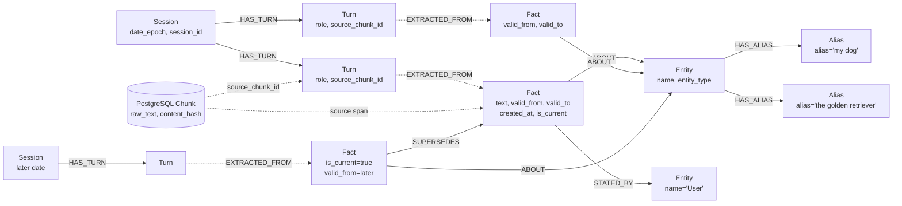

# Graph Schema Proposal — Generic Context Memory on HydraDB

> **Current runtime decision (2026-08-17):** use the checked-in HydraDB
> HTTP/OpenCypher server locally. PostgreSQL keeps immutable evidence; the
> application builds validated graph plans; HydraDB durably stores, indexes, and
> traverses them. Hosted dashboard APIs are not part of this MVP runtime.

## 1. HydraDB Grounding (Step 1 Confirmations)

### Connection

- **HTTP JSON API** at port 8443 — primary application interface.
- Bolt remains an upstream server surface, but the official Python driver rejects
  this build's `SlateDBGraph/0.1.0` server product before query execution.
- Auth via bearer token file.

### Supported Cypher Subset (from [cypher-compat.md](../hydradb/cypher-compat.md))

| Feature                                                                                            | Status |
| -------------------------------------------------------------------------------------------------- | ------ |
| `MATCH` (directed, one rel type each)                                                            | ✅     |
| `OPTIONAL MATCH` (reads only)                                                                    | ✅     |
| `WHERE` (`=`, `<>`, `<`, `>`, `<=`, `>=`, `STARTS WITH`, `AND`, `OR`, `NOT`) | ✅     |
| `RETURN` with `DISTINCT`, `ORDER BY`, `SKIP`, `LIMIT`                                    | ✅     |
| Aggregates:`count`, `sum`, `avg`, `collect`                                                | ✅     |
| `UNION` / `UNION ALL` (reads, same columns)                                                    | ✅     |
| `WITH` (pass-through only, no alias/filter)                                                      | ✅     |
| `CREATE`, `MERGE` (by id), `SET`, `DELETE`, `DETACH DELETE`                              | ✅     |
| `UNWIND $rows` batched writes                                                                    | ✅     |
| Variable-length paths`*min..max` (max required)                                                  | ✅     |
| `algo.SPpaths`, `algo.SSpaths`, `algo.MSpaths`                                               | ✅     |

**NOT supported** (confirmed):

- `IN`, `ENDS WITH`, `CONTAINS`, `IS NULL` in `WHERE`
- `RETURN *`
- `min()`, `max()` aggregates
- `DISTINCT` inside aggregate arguments
- `WITH` aliasing, filtering, ordering
- Unbounded variable-length paths (`*` or `*1..`)
- `ON CREATE` / `ON MATCH` on `MERGE`
- Undirected relationship patterns
- Multi-type relationship patterns in one `MATCH`
- More than one statement per request

### Native Path Procedures

```
algo.SPpaths  — one source → one target, bounded
algo.SSpaths  — one source → all reachable, bounded
algo.MSpaths  — many sources/targets resolved by indexed property values, batched
```

`algo.MSpaths` parameters confirmed:
`sourceLabel`, `sourceProperty`, `sourceValues`, `targetValues`, `pairwise`, `relTypes`, `relDirection`, `maxLen`, `pathCount`, `fairRelationshipVariants`, `resultLimit`.

> [!IMPORTANT]
> **No native community-detection or clustering procedure exists in HydraDB.** Only path-finding procedures are available. Any clustering must be done application-side.

### Consistency Model (from [architecture.md](../hydradb/architecture.md))

- **Causal** (default): uses the node's current durable reader view; refreshes only when a bookmark requires a newer sequence.
- **Strong**: refreshes from object storage before pinning snapshot — pays freshness cost.
- Every query runs against **one pinned SlateDB snapshot** — internally strongly consistent.
- **Single writer per cell** — two people writing to the same graph must target the same cell; mutations are serialized through the writer lease. No concurrent-write conflicts, but writes are sequential. For a hackathon with two writers this is fine — writes are fast and sequential through one lease holder.

---

## 2. Generic Context Contract and LongMemEval Adapter Profile

The approved field-level definition is [Generic Context Ingestion Contract v1](ingestion_contract_v1.md). This section summarizes its graph-facing boundary.

### Core Boundary

Graph and storage layers consume source-neutral context records, never LongMemEval records directly. Draft canonical envelope:

```text
ContextBatch
  contract_version
  ingestion_id / idempotency_key
  context_id
  source_type
  source_external_id
  records[]

ContextRecord
  record_id
  session_id (optional)
  actor_id / actor_role (optional)
  occurred_at
  content_type
  content
  metadata
```

Exact API shape remains a Milestone 0 decision. Source adapters may add validation, but cannot bypass generic chunking, extraction, persistence, graph, embedding, or recovery paths.

### LongMemEval Adapter Mapping

| LongMemEval input                                    | Generic ingestion field                                        |
| ---------------------------------------------------- | -------------------------------------------------------------- |
| benchmark instance /`question_id`                  | stable benchmark-derived`context_id` used only for isolation |
| `haystack_session_ids[i]`                          | raw ID in metadata; canonical `session_id` qualified with source index |
| `haystack_dates[i]`                                | parsed `occurred_at`; raw timestamp/timezone policy preserved in metadata |
| turn`role`                                         | actor role                                                     |
| turn`content`                                      | record content                                                 |
| adapter run identity                                 | ingestion ID / idempotency key                                 |
| `has_answer`, answer, answer-session IDs, `_abs` | evaluation harness only; never generic ingestion fields        |

### LongMemEval Data Format (confirmed from [README](https://github.com/xiaowu0162/LongMemEval))

Each of the 500 instances in `longmemeval_s.json` (now `longmemeval_s_cleaned.json`) contains:

| Field                    | Type                 | Description                                                                                                                                       |
| ------------------------ | -------------------- | ------------------------------------------------------------------------------------------------------------------------------------------------- |
| `question_id`          | `string`           | Unique ID; suffix`_abs` → abstention question                                                                                                  |
| `question_type`        | `string`           | One of the 6 types                                                                                                                                |
| `question`             | `string`           | Question text                                                                                                                                     |
| `answer`               | `string`           | Expected ground-truth answer                                                                                                                      |
| `question_date`        | `string`           | Date the question is "asked"                                                                                                                      |
| `haystack_session_ids` | `list[string]`     | Parallel session identifiers; local-data inspection found duplicates in 13 instances |
| `haystack_dates`       | `list[string]`     | Parallel timezone-free timestamps in `%Y/%m/%d (%a) %H:%M`; adapter stable-sorts sessions |
| `haystack_sessions`    | `list[list[dict]]` | List of sessions; each session is a list of turns:`{"role": "user"/"assistant", "content": "..."}`. Evidence turns have `"has_answer": true`. |
| `answer_session_ids`   | `list[string]`     | Gold session IDs (for retrieval eval)                                                                                                             |

### Harness Interface

There is **no formal base class or plugin interface**. The expected workflow is:

1. Feed timestamped history into your memory system
2. For each question, retrieve relevant context and generate an answer
3. Output a JSONL file with `question_id` and `hypothesis` per line
4. Run `src/evaluation/evaluate_qa.py` to score

### Scoring

**LLM-as-a-judge** using GPT-4o-mini or GPT-4o. The judge prompt varies by question type:

- `single-session-user`, `single-session-assistant`, `multi-session`: standard semantic equivalence check
- `temporal-reasoning`: same, but tolerates off-by-one errors in day counts
- `knowledge-update`: uses a template checking for the *latest* correct value
- `single-session-preference`: (likely same as standard, from the code patterns seen)

`question_type` is supplied by the LongMemEval evaluation harness. The benchmark
retrieval adapter may map it to an optional strategy hint, but the generic
retrieval contract must work when no such label exists.

---

## 3. Node and Relationship Schema

### Design Rationale

The schema has **five node types** and **seven relationship types** for generic conversational/context memory while retaining direct coverage of all six LongMemEval question categories. Memory type and memory scope are properties of evidence and facts, not additional graph labels. Raw chunks and embeddings are durable application records in PostgreSQL; HydraDB stores their identifiers and graph-native interpretation.

### Node Labels

```
Session     — one per source session inside a context
Turn        — one per user/assistant message within a session
Fact        — an atomic factual claim extracted from a turn
Entity      — a resolved canonical entity (person, place, thing, topic)
Alias       — an alternative surface form for an entity
```

### Relationship Types

```
HAS_TURN        Session → Turn           (ordered turns within a session)
EXTRACTED_FROM  Fact → Turn              (provenance link)
ABOUT           Fact → Entity            (what entity does this fact describe)
STATED_BY       Fact → Entity            (the speaker: "User" or "Assistant" entity)
SUPERSEDES      Fact → Fact              (knowledge-update: newer fact replaces older)
RELATES_TO      Entity → Entity          (general semantic link between entities)
HAS_ALIAS       Entity → Alias           (alternative surface form for entity lookup)
```

### Schema as Cypher `CREATE` Statements

These statements illustrate the intended records and relationships. Node `id` is always a non-negative integer (HydraDB requirement). Before implementation, convert each example into HydraDB-supported `MERGE`/`MATCH`/`UNWIND` mutations and verify it against the checked-in parser; standalone examples below are not executable migration scripts.

```cypher
-- ============================================================
-- SESSIONS
-- ============================================================
CREATE (s:Session {
  id: 1,
  context_id: 'context_001',
  session_id: 'session_001',
  date: '2024-03-15',
  date_epoch: 1710460800,
  turn_count: 8,
  source_index: 0
})-[:HAS_TURN]->(t:Turn {
  id: 100,
  context_id: 'context_001',
  turn_index: 0,
  role: 'user',
  source_chunk_id: 'chunk_h001_s001_t000',
  content_hash: 'sha256:example',
  session_id: 'session_001'
})

-- ============================================================
-- FACTS
-- ============================================================
CREATE (f:Fact {
  id: 1000,
  context_id: 'context_001',
  text: 'User adopted a golden retriever named Max',
  speaker: 'user',
  session_id: 'session_001',
  memory_type: 'semantic',
  scope_type: 'user',
  scope_id: 'user_context_001',
  source_chunk_id: 'chunk_h001_s001_t000',
  source_start: 0,
  source_end: 47,
  content_hash: 'sha256:example',
  observed_at: 1710460800,
  superseded_at: 9999999999,
  valid_from: 1710460800,
  valid_to: 9999999999,
  created_at: 1723744469,
  is_current: true
})-[:EXTRACTED_FROM]->(t:Turn {id: 100})

-- ============================================================
-- ENTITIES
-- ============================================================
CREATE (e:Entity {
  id: 2000,
  context_id: 'context_001',
  name: 'Max',
  canonical_name: 'max',
  selector_key: 'context_001::max',
  entity_type: 'pet'
})

-- ============================================================
-- ENTITY ALIASES (separate nodes)
-- ============================================================
CREATE (e:Entity {id: 2000})-[:HAS_ALIAS]->(a1:Alias {id: 3000, context_id: 'context_001', alias: 'my dog', canonical_alias: 'my dog'})
CREATE (e:Entity {id: 2000})-[:HAS_ALIAS]->(a2:Alias {id: 3001, context_id: 'context_001', alias: 'the golden retriever', canonical_alias: 'the golden retriever'})

-- ============================================================
-- FACT → ENTITY links
-- ============================================================
CREATE (f:Fact {id: 1000})-[:ABOUT]->(e:Entity {id: 2000})

-- ============================================================
-- SPEAKER entity (User / Assistant as canonical entities)
-- ============================================================
CREATE (f:Fact {id: 1000})-[:STATED_BY]->(speaker:Entity {id: 9999, context_id: 'context_001'})

-- ============================================================
-- KNOWLEDGE UPDATE (SUPERSEDES)
-- ============================================================
-- Later session contradicts: "Actually Max is a labrador, not a golden retriever"
CREATE (f_new:Fact {
  id: 1001,
  context_id: 'context_001',
  text: 'Max is a labrador',
  speaker: 'user',
  session_id: 'session_042',
  memory_type: 'semantic',
  scope_type: 'user',
  scope_id: 'user_context_001',
  source_chunk_id: 'chunk_h001_s042_t000',
  source_start: 0,
  source_end: 26,
  content_hash: 'sha256:example-new',
  observed_at: 1718006400,
  superseded_at: 9999999999,
  valid_from: 1718006400,
  valid_to: 9999999999,
  created_at: 1723744469,
  is_current: true
})-[:SUPERSEDES]->(f_old:Fact {id: 1000})
-- f_old.is_current is then SET to false
-- f_old.superseded_at is SET to 1718006400 (knowledge-time boundary)
-- f_old.valid_to changes only if the new evidence describes a real-world state change;
-- a correction does not automatically rewrite world-validity history.


-- ============================================================
-- GENERAL ENTITY-ENTITY RELATIONSHIP
-- ============================================================
CREATE (e1:Entity {id: 2000})-[:RELATES_TO {relation: 'pet_of'}]->(e2:Entity {id: 9999})
```

### Property Types Summary

| Node              | Property            | Type        | Purpose                                                                                    |
| ----------------- | ------------------- | ----------- | ------------------------------------------------------------------------------------------ |
| **Session** | `id`              | `int`     | HydraDB node identity                                                                      |
|                   | `context_id`      | `string`  | Generic isolation boundary supplied by caller or source adapter                            |
|                   | `session_id`      | `string`  | Optional source session/conversation identifier                                            |
|                   | `date`            | `string`  | Human-readable date`YYYY-MM-DD`                                                          |
|                   | `date_epoch`      | `int`     | Unix epoch seconds — for numeric comparison in`WHERE`                                   |
|                   | `turn_count`      | `int`     | Number of turns                                                                            |
|                   | `source_index`    | `int`     | Positional index in source ordering                                                        |
| **Turn**    | `id`              | `int`     | HydraDB node identity                                                                      |
|                   | `context_id`      | `string`  | Inherited generic context identifier                                                       |
|                   | `turn_index`      | `int`     | Position within session (0-based)                                                          |
|                   | `role`            | `string`  | `'user'` or `'assistant'`                                                              |
|                   | `source_chunk_id` | `string`  | PostgreSQL chunk identifier; canonical raw text is stored in SQL                           |
|                   | `content_hash`    | `string`  | Hash used to verify that graph provenance still points to the same immutable chunk         |
|                   | `session_id`      | `string`  | Denormalized for quick filtering                                                           |
| **Fact**    | `id`              | `int`     | HydraDB node identity                                                                      |
|                   | `context_id`      | `string`  | Inherited generic context identifier                                                       |
|                   | `text`            | `string`  | Atomic fact statement                                                                      |
|                   | `speaker`         | `string`  | `'user'` or `'assistant'`                                                              |
|                   | `session_id`      | `string`  | Which session this came from                                                               |
|                   | `memory_type`     | `string`  | `episodic`, `semantic`, or `procedural`                                              |
|                   | `scope_type`      | `string`  | `chat`, `session`, `user`, or optional `organization`                              |
|                   | `scope_id`        | `string`  | Identifier of the owning chat, session, user, or organization                              |
|                   | `source_chunk_id` | `string`  | PostgreSQL chunk containing the immutable source evidence                                  |
|                   | `source_start`    | `int`     | Inclusive character offset of the supporting span within the raw chunk                     |
|                   | `source_end`      | `int`     | Exclusive character offset of the supporting span within the raw chunk                     |
|                   | `content_hash`    | `string`  | Expected hash of the source chunk at extraction time                                       |
|                   | `observed_at`     | `int`     | Session/turn epoch when this claim entered memory; used for historical replay cutoff       |
|                   | `superseded_at`   | `int`     | Epoch when this claim stopped being the latest known assertion (`9999999999` while open) |
|                   | `valid_from`      | `int`     | Epoch when this fact became true (defaults to session`date_epoch`)                       |
|                   | `valid_to`        | `int`     | Epoch when this fact stopped being true (`9999999999` = still valid)                     |
|                   | `created_at`      | `int`     | Epoch when this fact was ingested into the graph                                           |
|                   | `is_current`      | `boolean` | `true` if not superseded (structural flag, distinct from temporal validity)              |
| **Entity**  | `id`              | `int`     | HydraDB node identity                                                                      |
|                   | `context_id`      | `string`  | Context isolation key for entities from any source                                         |
|                   | `name`            | `string`  | Display name                                                                               |
|                   | `canonical_name`  | `string`  | Lowercased normalized name for matching                                                    |
|                   | `selector_key`    | `string`  | Context-qualified selector (`<context_id>::<canonical_name>`) for native path isolation  |
|                   | `entity_type`     | `string`  | **Fixed enum** — must be one of the values in the Entity Type Enum table below      |

#### Entity Type Enum

Both the extraction LLM prompt and any retrieval-side filters **must** use values from this table — no synonyms, no ad-hoc variants.

| Value             | Use for                                      | Examples from LongMemEval-style chats                          |
| ----------------- | -------------------------------------------- | -------------------------------------------------------------- |
| `person`        | Named individuals                            | family members, friends, colleagues, doctors, celebrities      |
| `pet`           | Animals owned by or associated with the user | dogs, cats, fish by name                                       |
| `place`         | Physical locations                           | cities, restaurants, offices, parks, "my apartment"            |
| `organization`  | Companies, institutions, groups              | employers, schools, hospitals, clubs                           |
| `event`         | Specific occurrences with a time component   | trips, weddings, job changes, medical appointments             |
| `creative_work` | Books, movies, songs, shows, games           | "Inception", "To Kill a Mockingbird"                           |
| `product`       | Physical or digital items                    | gadgets, cars, medications, software, food brands              |
| `activity`      | Hobbies, sports, routines                    | running, cooking, yoga, "my morning routine"                   |
| `preference`    | Stated likes, dislikes, tastes               | "prefers Italian food", "hates Mondays", "favorite color"      |
| `topic`         | Abstract concepts, fields, general subjects  | "machine learning", "politics", "the weather"                  |
| `other`         | Safety valve — when none of the above fit   | Use sparingly; signals the extraction prompt may need updating |
| **Alias**   | `id`                                       | `int`                                                        |
|                   | `context_id`                               | `string`                                                     |
|                   | `alias`                                    | `string`                                                     |
|                   | `canonical_alias`                          | `string`                                                     |

### Relationship Properties

| Relationship   | Property          | Type       | Purpose                                                     |
| -------------- | ----------------- | ---------- | ----------------------------------------------------------- |
| `HAS_TURN`   | `turn_index`    | `int`    | Order within session                                        |
| `SUPERSEDES` | `superseded_at` | `int`    | Epoch when the supersession was recorded                    |
| `RELATES_TO` | `relation`      | `string` | Semantic relation label (e.g.,`'pet_of'`, `'works_at'`) |
| `HAS_ALIAS`  | *(none)*        | —         | Links entity to an alias surface form                       |

### ID Allocation Strategy

HydraDB requires non-negative integer IDs. PostgreSQL owns the durable global registry for both nodes and relationships: `(kind, context_id, logical_key) -> graph_id`. Relationship kinds use names such as `relationship:ABOUT`. Never use fixed ranges or fixed speaker IDs; they collide across generic contexts.

Before HTTP mutation, `graph_write_manifests` stores each logical record’s graph ID and immutable scalar payload hash. Same replay is accepted; changed payload conflicts before graph mutation. The adapter writes one supported `UNWIND` statement per node label or directed relationship type. HTTP `query_id` is not server-side durable idempotency; deterministic `MERGE` identities plus the local manifest protect replay. Full-plan recovery and mutation of an earlier fact’s temporal fields remain Milestone 8 work.

---

## 4. How Each Question Type Is Answered

### 1. `single-session-user`

**Traversal**: `MATCH (f:Fact {context_id: $hid})-[:ABOUT]->(e:Entity {context_id: $hid})` where `f.speaker = 'user'` and `e.canonical_name` matches the entity extracted from the question. Filter `f.is_current = true`. Return `f.text` and provenance. **Single-hop, scoped strictly by `context_id`.**

### 2. `single-session-assistant`

**Traversal**: Identical to above but with `f.speaker = 'assistant'`, scoped by `f.context_id = $hid` and `e.context_id = $hid`. **Single-hop.**

### 3. `single-session-preference`

**Traversal**: Same as `single-session-user` with `f.context_id = $hid`, matching Entity with `entity_type = 'preference'` or capturing the preference in fact text. **Single-hop.**

### 4. `multi-session`

**Traversal**: Use `algo.MSpaths` with `sourceLabel: 'Entity'`, `sourceProperty: 'selector_key'`, identical context-qualified `sourceValues` and `targetValues`, `pairwise: true`, `relTypes: ['ABOUT']`, `relDirection: 'both'`, and `maxLen: 4`. The qualified selector prevents same-named entities from other contexts entering native path resolution. Returned nodes are still verified against `context_id`. **Multi-hop bridging across sessions within the same context.**

### 5. `knowledge-update`

**Traversal**: `MATCH (f_current:Fact {context_id: $hid})-[:ABOUT]->(e:Entity {context_id: $hid})` where `e` matches the question entity and `f_current.is_current = true`. To retrieve the full update chain: `MATCH (f_current:Fact {context_id: $hid})-[:SUPERSEDES*1..5]->(f_old:Fact {context_id: $hid})` using bounded variable-length path. The answer is `f_current.text` (the latest state). **The `SUPERSEDES` chain is scoped by `context_id`.**

### 6. `temporal-reasoning`

**Traversal**: First select memories whose knowledge interval contains `question_date`: `f.observed_at <= $question_epoch AND f.superseded_at > $question_epoch`. For temporal questions, separately resolve the target time expressed by the question and filter facts whose validity window overlaps that target: `f.valid_from <= $target_epoch AND f.valid_to >= $target_epoch`. `observed_at`/`superseded_at` answer “when did the system know or prefer this assertion?”; `valid_from`/`valid_to` answer “when was this true in the world?”. Conflating them causes future-information leakage or incorrectly hides known future plans.

---

## 5. Memory Model and Deterministic vs LLM Responsibilities

### 5.1 Memory Types and Memory Scope

Memory **type** describes what a memory represents. Memory **scope** describes who owns it and how broadly it may be retrieved. These are orthogonal dimensions; `user` is not a fourth memory type, and `semantic` does not imply organization-wide visibility.

This vocabulary follows the useful engineering analogy in [Cognitive Architectures for Language Agents (CoALA)](https://arxiv.org/abs/2309.02427): working memory holds current state, while long-term memory can be procedural, semantic, or episodic.

#### Memory Type

| Type           | Meaning in this system                                                                            | Primary representation                                                                           | MVP use                    |
| -------------- | ------------------------------------------------------------------------------------------------- | ------------------------------------------------------------------------------------------------ | -------------------------- |
| `episodic`   | Timestamped experience: something said, observed, or done in a particular session                 | Immutable SQL chunk plus`Session`/`Turn` provenance in HydraDB                               | Required                   |
| `semantic`   | Consolidated fact, entity property, preference, or relationship derived from one or more episodes | `Fact`/`Entity` graph with source links and temporal validity                                | Required                   |
| `procedural` | Instruction, workflow, rule, or learned way of performing a task                                  | `Fact` initially; dedicated procedure representation deferred until retrieval needs justify it | Classification only in MVP |

One source chunk may yield several semantic facts. A semantic or procedural memory must retain links to supporting episodic evidence. Classification does not authorize deletion or rewriting of the original episode.

#### Memory Scope Hierarchy

```text
chat memory -> session memory -> user memory -> organization memory (optional)
```

| Scope            | Lifetime and access                               | MVP behavior                                                        |
| ---------------- | ------------------------------------------------- | ------------------------------------------------------------------- |
| `chat`         | Current working context; shortest lived           | May remain in-process and need not be promoted                      |
| `session`      | One bounded conversation episode                  | Persist chunk, turns, summaries, and extracted facts                |
| `user`         | Durable cross-session memory for one user         | Primary durable personalized retrieval scope; LongMemEval maps here |
| `organization` | Shared, permission-controlled memory across users | Deferred; never inferred or promoted automatically in MVP           |

Promotion is an explicit application action, not a side effect of graph traversal. For example, a session episode may produce a user-scoped semantic preference after extraction and validation. Organization promotion requires provenance, access control, and an approved policy.

### 5.2 Atomic Fact Extraction from a Chat Turn

**Decision: LLM**

**Reasoning**: Context records contain free-form natural language with implicit references, multi-clause sentences, hedging, and conversational filler. A rule-based extractor cannot reliably decompose all supported sources into clean atomic facts. A model-backed extractor with validated structured output is therefore the proposed production path, behind a provider-neutral adapter and preceded by deterministic fakes. Unlike the bounded LongMemEval fixture, generic ingestion volume is unknown; model cost, latency, batching, privacy, and fallback behavior remain explicit approval and measurement concerns.

### 5.3 Memory Classification and Scope Assignment

**Decision: Hybrid — deterministic defaults + structured LLM classification**

**Reasoning**: Every raw turn is episodic by construction. Extracted factual claims default to `semantic`; explicit instructions, repeatable workflows, or rules are candidates for `procedural`. Scope defaults deterministically from ingestion context (`session` or `user`). An LLM may propose `memory_type`, but a schema validator enforces the enum and an application policy decides promotion. `organization` is rejected unless the caller supplies an authorized organization scope.

### 5.4 Entity/Subject Resolution Across Turns and Sessions

**Implemented M5 boundary: deterministic context-scoped matching first; bounded LLM judgment second; no graph writes yet.**

**Decision: bounded LLM assistance, not unrestricted entity search**

**Reasoning**: `NFKC`/whitespace/case-folded canonical and explicit alias matching solve deterministic cases inside one `context_id`. For references such as “my dog” → “Max”, application supplies a bounded same-context candidate set and an LLM may select one candidate ID or abstain. It cannot create cross-context identity links or select an ID outside that set. Embedding candidate discovery remains deferred; provider selection, privacy, cost, and structured-output evaluation remain held.

### 5.5 Detecting Whether a New Fact Contradicts/Updates an Existing One

**Decision: deterministic gate + bounded LLM classification**

**Reasoning**: M5 calls the model only when subject entity and explicit `predicate_key` are equal and the new record has strictly newer `observed_at`. It returns one closed result: `correction`, `state_change`, `no_update`, or `unresolved`. Correction closes knowledge time only. State change closes world validity only at incoming evidence-supported `valid_from`, or observation time; the model never invents a timestamp. Out-of-order, unrelated, invalid, or abstaining output remains no-update/unresolved.

### 5.6 Resolving Relative Time Expressions in Questions

**Decision: Deterministic (with LLM fallback for complex cases)**

**Reasoning**: Generic queries may contain calendar-relative expressions such as "last month" and event-anchored expressions such as "before I switched jobs." The query contract must supply a reference time when relative interpretation is required; the LongMemEval adapter maps `question_date` to that field. Calendar-relative phrases use deterministic date math where possible. Event-anchored phrases first resolve the event from memory, then apply date math. Ambiguous phrasing may use a model fallback behind an adapter. Coverage and fallback rate must be measured on generic and LongMemEval fixtures rather than assumed from the benchmark alone.

### 5.7 Query Strategy Selection

**Decision: Generic retrieval cannot require `question_type`**

**Reasoning**: LongMemEval supplies `question_type`, so its evaluation adapter may
map that label to an optional retrieval strategy hint. Generic callers may not
have a trustworthy label. The default retrieval path must therefore operate
without one. Deterministic signals such as temporal expressions and update
language may select bounded specialist steps; model-based classification remains
a held option for ambiguous production queries. Benchmark labels must not become
core ingestion fields or required retrieval inputs.

---

## 6. Handling Distractor/Filler Sessions

The schema and retrieval pipeline reduce distractor influence through multiple independent filters:

1. **SQL semantic seeding is context-scoped** — candidates from other contexts never enter retrieval.
2. **Graph expansion is entity-driven** — qualified entity selectors and `context_id` verification reject cross-context paths.
3. **Hybrid ranking requires semantic and structural support** — disconnected filler is unlikely to survive both signals.
4. **Progressive evidence assembly is bounded** — only supporting spans and necessary neighboring context enter the reader prompt by default.

Graph topology is not a complete relevance guarantee: distractor facts can mention the same entity. Retrieval quality must therefore be measured on evidence recall and false-positive context, not assumed from connectivity alone.

---

## 7. Unconfirmed Items and Assumptions

| Item                                                                                       | Status                                                               | Assumption Made                                                                                                                                                                                                                        |
| ------------------------------------------------------------------------------------------ | -------------------------------------------------------------------- | -------------------------------------------------------------------------------------------------------------------------------------------------------------------------------------------------------------------------------------- |
| **Exact `single-session-preference` judge prompt**                                 | Could not confirm from truncated eval script                         | Assumed same template as`single-session-user`                                                                                                                                                                                        |
| **Whether `knowledge-update` judge prompt specifically checks for "latest" value** | Partially confirmed — the eval code was truncated at line 39        | Assumed from the paper description that the judge checks the response contains the most recent/updated information                                                                                                                     |
| **Property value types**                                                             | Confirmed scalar-only in`cypher-compat.md`                         | Aliases remain separate nodes; embeddings remain in PostgreSQL/pgvector.                                                                                                                                                               |
| **Whether `algo.MSpaths` can use `targetLabel` different from `sourceLabel`**  | Config keys listed but not explicitly tested for cross-label use     | Assumed`sourceLabel` and `targetLabel` can be different (e.g., source=`Entity`, target=`Fact`), since the config lists them as independent keys                                                                                |
| **`STARTS WITH` performance on string properties**                                 | Confirmed supported in`WHERE`                                      | Assumed it uses a prefix index or scan — acceptable for our data size (~1K entities)                                                                                                                                                  |
| **Concurrent ingestion by two writers**                                              | Confirmed single-writer-per-cell model with lease-based coordination | Both team members share the same cell. Writes are serialized through the lease holder — one writer holds the lease at a time, the other's writes route to it via Bolt routing. For ~40 sessions this is fine; no partitioning needed. |
| **`has_answer` field on turns**                                                    | Confirmed evaluation-only metadata                                   | Keep it in the benchmark harness; do not persist it in PostgreSQL application tables or HydraDB retrieval records.                                                                                                                     |
| **Final SQL chunk schema**                                                           | Open MVP decision                                                    | PostgreSQL is the canonical chunk store; exact chunk boundaries, metadata columns, and retention policy require a fixture-driven decision.                                                                                             |
| **Embedding target**                                                                 | Open MVP decision                                                    | PostgreSQL/pgvector supports chunk and fact embeddings. Initial retrieval should benchmark fact-only versus fact-plus-chunk seeding.                                                                                                   |
| **Memory promotion policy**                                                          | Open MVP decision                                                    | Episode-to-semantic promotion is allowed with provenance. Procedural and organization promotion need explicit validation policies.                                                                                                     |
| **Organization memory**                                                              | Deferred                                                             | Optional after user-scoped generic behavior, tenant isolation, and authorization are verified.                                                                                                                                         |
| **Cross-store consistency**                                                          | Open MVP design task                                                 | PostgreSQL and HydraDB cannot share one transaction; ingestion needs idempotency, checkpoints/outbox state, verification, and replay.                                                                                                  |

---

## 8. Graph Topology Visualization



---

## 9. MVP Next Steps (Not Implemented Yet)

Detailed sequencing, approval packets, tests, and milestone status live in [ingestion_pipeline_roadmap.md](ingestion_pipeline_roadmap.md). Accepted rationale, tradeoffs, hold-ons, and revisit triggers live in [decisions.md](decisions.md). This section remains a compact architecture summary.

1. **Record approved boundaries and generic input contract** — PostgreSQL owns immutable chunks, embeddings, model versions, and ingestion state; HydraDB owns graph structure, temporal relationships, and traversal; source adapters map versioned external payloads into one generic context envelope.
2. **Finalize SQL schema with fixtures** — Decide chunk boundaries and minimum columns; define chunk hashes, source offsets, embedding target (`fact`, `chunk`, or both), model versioning, and exact-search query shape.
3. **Finalize graph isolation and identities** — Replace per-context numeric ranges with collision-safe deterministic IDs; use context-qualified path selector keys; verify every Cypher statement against HydraDB's parser.
4. **Define memory classification contract** — Structured extraction schema for episodic, semantic, and procedural memory plus deterministic scope defaults and promotion rules. Keep organization scope disabled.
5. **Define cross-store recovery** — Idempotency keys, PostgreSQL ingestion jobs/outbox, HydraDB write verification, retry states, and replay after partial failure.
6. **Build deterministic generic ingestion vertical slice** — Ingest one source-neutral fixture into PostgreSQL and HydraDB without paid model calls; verify raw evidence, hashes, provenance, graph topology, and re-run idempotency. Then pass a bounded LongMemEval fixture through its adapter and the same service.
7. **Add model-backed extraction behind an adapter** — Validate structured outputs, retain rejected records, resolve entities, classify memory, and create supersession candidates without changing source evidence.
8. **Build retrieval vertical slice** — Exact pgvector semantic seeding, scoped HydraDB expansion, temporal filtering, hybrid ranking, and progressive evidence expansion from source span to neighboring turn to full chunk.
9. **Implement honest abstention** — Use evidence coverage, retrieval scores, temporal resolution, and unresolved contradictions. Never inspect `_abs` or `has_answer` at runtime.
10. **Integrate LongMemEval evaluation** — Emit `question_id`/`hypothesis` JSONL; measure answer accuracy, evidence Recall@K/MRR/NDCG, temporal/update accuracy, and abstention precision/recall.
11. **Benchmark open decisions** — Compare fact-only versus fact-plus-chunk embeddings, selective evidence versus full chunks, and exact pgvector search versus any future approximate index.
12. **Review living documentation** — Update schema, retrieval flow, decisions, test evidence, and operational notes before declaring MVP complete.

Architecture direction approved for documentation. Implementation still requires milestone approval after SQL schema and recovery design are concrete.
