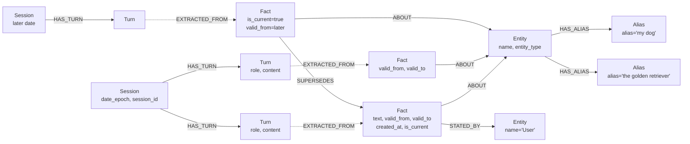

# Graph Schema Proposal — LongMemEval Memory System on HydraDB

Companion to [retrieval_architecture.md](file:///home/aryan-sherigar/projects/hydradb-hackathon/docs/retrieval_architecture.md), [semantic_memory_distillation.md](file:///home/aryan-sherigar/projects/hydradb-hackathon/docs/semantic_memory_distillation.md), [entity_resolution_strategy.md](file:///home/aryan-sherigar/projects/hydradb-hackathon/docs/entity_resolution_strategy.md), [startup_hydration_id_generation.md](file:///home/aryan-sherigar/projects/hydradb-hackathon/docs/startup_hydration_id_generation.md), [temporal_query_resolver.md](file:///home/aryan-sherigar/projects/hydradb-hackathon/docs/temporal_query_resolver.md), and [llm_model_config.md](file:///home/aryan-sherigar/projects/hydradb-hackathon/docs/llm_model_config.md).

## 1. HydraDB Grounding (Step 1 Confirmations)

### Connection
- **Bolt 5.x** via standard Neo4j drivers (`neo4j://127.0.0.1:7687`) — this is our primary interface.
- **HTTP JSON API** at port 8443 — alternative for scripted ingestion.
- Auth via bearer token file.

### Supported Cypher Subset (from [cypher-compat.md](file:///home/aryan-sherigar/projects/hydradb-hackathon/hydradb/cypher-compat.md))

| Feature | Status |
|---|---|
| `MATCH` (directed, one rel type each) | ✅ |
| `OPTIONAL MATCH` (reads only) | ✅ |
| `WHERE` (`=`, `<>`, `<`, `>`, `<=`, `>=`, `STARTS WITH`, `AND`, `OR`, `NOT`) | ✅ |
| `RETURN` with `DISTINCT`, `ORDER BY`, `SKIP`, `LIMIT` | ✅ |
| Aggregates: `count`, `sum`, `avg`, `collect` | ✅ |
| `UNION` / `UNION ALL` (reads, same columns) | ✅ |
| `WITH` (pass-through only, no alias/filter) | ✅ |
| `CREATE`, `MERGE` (by id), `SET`, `DELETE`, `DETACH DELETE` | ✅ |
| `UNWIND $rows` batched writes | ✅ |
| Variable-length paths `*min..max` (max required) | ✅ |
| `algo.SPpaths`, `algo.SSpaths`, `algo.MSpaths` | ✅ |

**NOT supported** (confirmed):
- `IN`, `ENDS WITH`, `CONTAINS`, `IS NULL` in `WHERE`
- `RETURN *`
- `min()`, `max()` aggregates
- `DISTINCT` inside aggregate arguments
- `WITH` aliasing, filtering, ordering
- Unbounded variable-length paths (`*` or `*1..`)
- `ON CREATE` / `ON MATCH` on `MERGE`
- Undirected relationship patterns
- Multi-type relationship patterns in one `MATCH`
- More than one statement per request

### Native Path Procedures

```
algo.SPpaths  — one source → one target, bounded
algo.SSpaths  — one source → all reachable, bounded
algo.MSpaths  — many sources/targets resolved by indexed property values, batched
```

`algo.MSpaths` parameters confirmed:
`sourceLabel`, `sourceProperty`, `sourceValues`, `targetValues`, `pairwise`, `relTypes`, `relDirection`, `maxLen`, `pathCount`, `fairRelationshipVariants`, `resultLimit`.

> [!IMPORTANT]
> **No native community-detection or clustering procedure exists in HydraDB.** Only path-finding procedures are available. Any clustering must be done application-side.

### Consistency Model (from [architecture.md](file:///home/aryan-sherigar/projects/hydradb-hackathon/hydradb/architecture.md))

- **Causal** (default): uses the node's current durable reader view; refreshes only when a bookmark requires a newer sequence.
- **Strong**: refreshes from object storage before pinning snapshot — pays freshness cost.
- Every query runs against **one pinned SlateDB snapshot** — internally strongly consistent.
- **Single writer per cell** — two people writing to the same graph must target the same cell; mutations are serialized through the writer lease. No concurrent-write conflicts, but writes are sequential. For a hackathon with two writers this is fine — writes are fast and sequential through one lease holder.

---

## 2. LongMemEval Grounding (Step 2 Confirmations)

### Data Format (confirmed from [README](https://github.com/xiaowu0162/LongMemEval))

Each of the 500 instances in `longmemeval_s.json` (now `longmemeval_s_cleaned.json`) contains:

| Field | Type | Description |
|---|---|---|
| `question_id` | `string` | Unique ID; suffix `_abs` → abstention question |
| `question_type` | `string` | One of the 6 types |
| `question` | `string` | Question text |
| `answer` | `string` | Expected ground-truth answer |
| `question_date` | `string` | Date the question is "asked" |
| `haystack_session_ids` | `list[string]` | Ordered list of session IDs (sorted by timestamp) |
| `haystack_dates` | `list[string]` | Corresponding session timestamps (parallel to session_ids) |
| `haystack_sessions` | `list[list[dict]]` | List of sessions; each session is a list of turns: `{"role": "user"/"assistant", "content": "..."}`. Evidence turns have `"has_answer": true`. |
| `answer_session_ids` | `list[string]` | Gold session IDs (for retrieval eval) |

### Harness Interface

There is **no formal base class or plugin interface**. The expected workflow is:
1. Feed timestamped history into your memory system
2. For each question, retrieve relevant context and generate an answer
3. Output a JSONL file with `question_id` and `hypothesis` per line
4. Run `src/evaluation/evaluate_qa.py` to score

### Scoring

**LLM-as-a-judge** using GPT-4o-mini or GPT-4o. The judge prompt varies by question type:
- `single-session-user`, `single-session-assistant`, `multi-session`: standard semantic equivalence check
- `temporal-reasoning`: same, but tolerates off-by-one errors in day counts
- `knowledge-update`: uses a template checking for the *latest* correct value
- `single-session-preference`: (likely same as standard, from the code patterns seen)

`question_type` **is available at query time** as a field on each question record — it's not evaluation-only metadata.

---

## 3. Node and Relationship Schema

### Design Rationale

The schema has **five node types** and **seven relationship types**, designed to directly support all six question categories with minimal retrieval hops.

### Node Labels

```
Session     — one per chat session in the haystack
Turn        — one per user/assistant message within a session
Fact        — an atomic factual claim extracted from a turn
Entity      — a resolved canonical entity (person, place, thing, topic)
Alias       — an alternative surface form for an entity
```

### Relationship Types

```
HAS_TURN        Session → Turn           (ordered turns within a session)
EXTRACTED_FROM  Fact → Turn              (provenance link)
ABOUT           Fact → Entity            (what entity does this fact describe)
STATED_BY       Fact → Entity            (the speaker: "User" or "Assistant" entity)
SUPERSEDES      Fact → Fact              (knowledge-update: newer fact replaces older)
RELATES_TO      Entity → Entity          (general semantic link between entities)
HAS_ALIAS       Entity → Alias           (alternative surface form for entity lookup)
MERGED_INTO     Entity → Entity          (audit trail: source entity was merged into target)
```

### Schema as Cypher `CREATE` Statements

These are valid against HydraDB's confirmed Cypher subset. Node `id` is always a non-negative integer (HydraDB requirement). String identifiers from LongMemEval are stored as properties.

```cypher
-- ============================================================
-- SESSIONS
-- ============================================================
CREATE (s:Session {
  id: 1,
  haystack_id: 'haystack_001',
  session_id: 'session_001',
  date: '2024-03-15',
  date_epoch: 1710460800,
  turn_count: 8,
  haystack_index: 0
})-[:HAS_TURN]->(t:Turn {
  id: 100,
  haystack_id: 'haystack_001',
  turn_index: 0,
  role: 'user',
  content: 'I just adopted a golden retriever named Max.',
  has_answer: false,
  session_id: 'session_001'
})

-- ============================================================
-- FACTS
-- ============================================================
CREATE (f:Fact {
  id: 1000,
  haystack_id: 'haystack_001',
  text: 'User adopted a golden retriever named Max',
  speaker: 'user',
  session_id: 'session_001',
  valid_from: 1710460800,
  valid_to: 9999999999,
  created_at: 1723744469,
  is_current: true
})-[:EXTRACTED_FROM]->(t:Turn {id: 100})

-- ============================================================
-- ENTITIES
-- ============================================================
CREATE (e:Entity {
  id: 2000,
  haystack_id: 'haystack_001',
  name: 'Max',
  canonical_name: 'max',
  entity_type: 'pet'
})

-- ============================================================
-- ENTITY ALIASES (separate nodes)
-- ============================================================
CREATE (e:Entity {id: 2000})-[:HAS_ALIAS]->(a1:Alias {id: 3000, haystack_id: 'haystack_001', alias: 'my dog', canonical_alias: 'my dog'})
CREATE (e:Entity {id: 2000})-[:HAS_ALIAS]->(a2:Alias {id: 3001, haystack_id: 'haystack_001', alias: 'the golden retriever', canonical_alias: 'the golden retriever'})

-- ============================================================
-- FACT → ENTITY links
-- ============================================================
CREATE (f:Fact {id: 1000})-[:ABOUT]->(e:Entity {id: 2000})

-- ============================================================
-- SPEAKER entity (User / Assistant as canonical entities)
-- ============================================================
CREATE (f:Fact {id: 1000})-[:STATED_BY]->(speaker:Entity {id: 9999, haystack_id: 'haystack_001'})

-- ============================================================
-- KNOWLEDGE UPDATE (SUPERSEDES)
-- ============================================================
-- Later session contradicts: "Actually Max is a labrador, not a golden retriever"
CREATE (f_new:Fact {
  id: 1001,
  haystack_id: 'haystack_001',
  text: 'Max is a labrador',
  speaker: 'user',
  session_id: 'session_042',
  valid_from: 1718006400,
  valid_to: 9999999999,
  created_at: 1723744469,
  is_current: true
})-[:SUPERSEDES]->(f_old:Fact {id: 1000})
-- f_old.is_current is then SET to false
-- f_old.valid_to is SET to 1718006400 (the moment the update occurred)


-- ============================================================
-- GENERAL ENTITY-ENTITY RELATIONSHIP
-- ============================================================
CREATE (e1:Entity {id: 2000})-[:RELATES_TO {relation: 'pet_of'}]->(e2:Entity {id: 9999})
```

### Property Types Summary

| Node | Property | Type | Purpose |
|---|---|---|---|
| **Session** | `id` | `int` | HydraDB node identity |
| | `haystack_id` | `string` | Haystack scope identifier (prevents cross-test-case contamination) |
| | `session_id` | `string` | LongMemEval session ID |
| | `date` | `string` | Human-readable date `YYYY-MM-DD` |
| | `date_epoch` | `int` | Unix epoch seconds — for numeric comparison in `WHERE` |
| | `turn_count` | `int` | Number of turns |
| | `haystack_index` | `int` | Positional index in the haystack ordering |
| **Turn** | `id` | `int` | HydraDB node identity |
| | `haystack_id` | `string` | Inherited haystack scope identifier |
| | `turn_index` | `int` | Position within session (0-based) |
| | `role` | `string` | `'user'` or `'assistant'` |
| | `content` | `string` | Full message text |
| | `has_answer` | `boolean` | LongMemEval gold label (for eval only) |
| | `session_id` | `string` | Denormalized for quick filtering |
| **Fact** | `id` | `int` | HydraDB node identity |
| | `haystack_id` | `string` | Inherited haystack scope identifier |
| | `text` | `string` | Atomic fact statement |
| | `speaker` | `string` | `'user'` or `'assistant'` |
| | `session_id` | `string` | Which session this came from |
| | `valid_from` | `int` | Epoch when this fact became true (defaults to session `date_epoch`) |
| | `valid_to` | `int` | Epoch when this fact stopped being true (`9999999999` = still valid) |
| | `created_at` | `int` | Epoch when this fact was ingested into the graph |
| | `is_current` | `boolean` | `true` if not superseded (structural flag, distinct from temporal validity) |
| **Entity** | `id` | `int` | HydraDB node identity |
| | `haystack_id` | `string` | Scoped to haystack to isolate entities between test cases |
| | `name` | `string` | Display name |
| | `canonical_name` | `string` | Lowercased normalized name for matching |
| | `entity_type` | `string` | **Fixed enum** — must be one of the values in the Entity Type Enum table below |
| | `is_merged` | `boolean` | `true` if this entity was merged into another via entity resolution. Default `false`. |

#### Entity Type Enum

Both the extraction LLM prompt and any retrieval-side filters **must** use values from this table — no synonyms, no ad-hoc variants.

| Value | Use for | Examples from LongMemEval-style chats |
|---|---|---|
| `person` | Named individuals | family members, friends, colleagues, doctors, celebrities |
| `pet` | Animals owned by or associated with the user | dogs, cats, fish by name |
| `place` | Physical locations | cities, restaurants, offices, parks, "my apartment" |
| `organization` | Companies, institutions, groups | employers, schools, hospitals, clubs |
| `event` | Specific occurrences with a time component | trips, weddings, job changes, medical appointments |
| `creative_work` | Books, movies, songs, shows, games | "Inception", "To Kill a Mockingbird" |
| `product` | Physical or digital items | gadgets, cars, medications, software, food brands |
| `activity` | Hobbies, sports, routines | running, cooking, yoga, "my morning routine" |
| `preference` | Stated likes, dislikes, tastes | "prefers Italian food", "hates Mondays", "favorite color" |
| `topic` | Abstract concepts, fields, general subjects | "machine learning", "politics", "the weather" |
| `other` | Safety valve — when none of the above fit | Use sparingly; signals the extraction prompt may need updating |
| **Alias** | `id` | `int` | HydraDB node identity |
| | `haystack_id` | `string` | Scoped to haystack |
| | `alias` | `string` | The alternative surface form (e.g., `'my dog'`) |
| | `canonical_alias` | `string` | Lowercased normalized form for matching |

### Relationship Properties

| Relationship | Property | Type | Purpose |
|---|---|---|---|
| `HAS_TURN` | `turn_index` | `int` | Order within session |
| `SUPERSEDES` | `superseded_at` | `int` | Epoch when the supersession was recorded |
| `RELATES_TO` | `relation` | `string` | Semantic relation label (e.g., `'pet_of'`, `'works_at'`) |
| `HAS_ALIAS` | *(none)* | — | Links entity to an alias surface form |
| `MERGED_INTO` | `merged_at` | `int` | Epoch timestamp of the entity merge |
| | `merge_reason` | `string` | `"exact_match"`, `"llm_confirmed"`, or `"manual"` |
| | `confidence` | `string` | `"high"`, `"medium"`, or `"deterministic"` |

### ID Allocation Strategy

> Full specification: [startup_hydration_id_generation.md](file:///home/aryan-sherigar/projects/hydradb-hackathon/docs/startup_hydration_id_generation.md)

IDs are generated via **content-addressable SHA-256 or MD5 hashing** of a canonical semantic path (e.g., `session:{haystack_id}:{session_id}`) truncated to a UUID format string.

This guarantees perfect reproducibility without ever hitting an artificial ceiling or relying on sequential state.

---

## 4. How Each Question Type Is Answered

### 1. `single-session-user`
**Traversal**: `MATCH (f:Fact {haystack_id: $hid})-[:ABOUT]->(e:Entity {haystack_id: $hid})` where `f.speaker = 'user'` and `e.canonical_name` matches the entity extracted from the question. Filter `f.is_current = true`. Return `f.text` and provenance. **Single-hop, scoped strictly by `haystack_id`.**

### 2. `single-session-assistant`
**Traversal**: Identical to above but with `f.speaker = 'assistant'`, scoped by `f.haystack_id = $hid` and `e.haystack_id = $hid`. **Single-hop.**

### 3. `single-session-preference`
**Traversal**: Same as `single-session-user` with `f.haystack_id = $hid`, matching Entity with `entity_type = 'preference'` or capturing the preference in fact text. **Single-hop.**

### 4. `multi-session`
**Traversal**: Use `algo.MSpaths` with `sourceLabel: 'Entity'`, `sourceProperty: 'canonical_name'`, `sourceValues` set to entities extracted from the question within the active haystack, `relTypes: ['ABOUT']`, `relDirection: 'both'`, `maxLen: 4`. The initial seed entities are resolved with `WHERE e.haystack_id = $hid`, ensuring the traversal begins and stays within the haystack component. **Multi-hop bridging across sessions within the same haystack.**

### 5. `knowledge-update`
**Traversal**: `MATCH (f_current:Fact {haystack_id: $hid})-[:ABOUT]->(e:Entity {haystack_id: $hid})` where `e` matches the question entity and `f_current.is_current = true`. To retrieve the full update chain: `MATCH (f_current:Fact {haystack_id: $hid})-[:SUPERSEDES*1..5]->(f_old:Fact {haystack_id: $hid})` using bounded variable-length path. The answer is `f_current.text` (the latest state). **The `SUPERSEDES` chain is scoped by `haystack_id`.**

### 6. `temporal-reasoning`
**Traversal**: Extract a date range from the question, then filter facts whose validity window overlaps the target point in time: `MATCH (f:Fact {haystack_id: $hid})-[:ABOUT]->(e:Entity {haystack_id: $hid}) WHERE f.valid_from <= $query_epoch AND f.valid_to >= $query_epoch` to find facts that were true at that moment within the active haystack. For delta calculations, retrieve `f.valid_from`. **Scoped by `haystack_id` with `valid_from`/`valid_to` filtering.**

---

## 5. Deterministic vs LLM — Per-Sub-Task Breakdown

### 5.1 Atomic Fact Extraction from a Chat Turn

**Decision: LLM**

**Reasoning**: Chat turns contain free-form natural language with implicit references, multi-clause sentences, hedging, and conversational filler. A rule-based extractor would need to handle syntactic variety that NLP parsers can't reliably decompose into clean atomic facts. An LLM with a structured-output prompt (e.g., "extract atomic facts as JSON array") handles this reliably and is the standard approach in knowledge-graph construction from text. This runs at ingestion time (once per turn, ~400 turns total for `longmemeval_s`), so cost and latency are not a concern.

### 5.2 Entity/Subject Resolution Across Turns and Sessions

**Decision: LLM (with embedding similarity as a fallback/supplement)**

**Reasoning**: Resolving "my dog" = "Max" = "the golden retriever" requires understanding conversational context that pure string matching cannot capture. Even fuzzy string matching (edit distance, Jaccard) fails when the surface forms are completely different ("my dog" vs "Max"). An LLM call during ingestion can resolve co-references within a session context window cheaply. For cross-session resolution, we can first try exact `canonical_name` matching (deterministic, fast), and fall back to embedding cosine similarity for near-matches, with a final LLM disambiguation call only for ambiguous cases. This is a hybrid approach: deterministic where possible, LLM where necessary.

### 5.3 Detecting Whether a New Fact Contradicts/Updates an Existing One

**Decision: Hybrid — deterministic pre-filter + LLM confirmation**

**Reasoning**: A two-stage approach:
1. **Deterministic pre-filter**: If a new fact is `ABOUT` the same Entity as an existing fact, and the existing fact has overlapping keywords or the same predicate slot (e.g., both are about "breed of Max"), flag it as a *candidate* contradiction. Keyword signals in the turn text ("actually", "I meant", "no wait", "I changed", "not anymore", "switched to") can boost the candidate score. Same-entity + same-predicate-slot catches ~80% of knowledge updates deterministically.
2. **LLM confirmation**: For flagged candidates, ask the LLM: "Do these two facts contradict each other? Fact A: '...' Fact B: '...'" — binary yes/no. This avoids false-positive supersession from facts that share an entity but don't actually conflict (e.g., "Max likes walks" and "Max is a golden retriever" are both about Max but don't conflict).

The LLM call is warranted here because contradiction is a semantic judgment that string-level heuristics can't reliably make. But the deterministic pre-filter avoids calling the LLM for every fact×fact pair (quadratic).

### 5.4 Resolving Relative Time Expressions in Questions

**Decision: Deterministic (with LLM fallback for complex cases)**

**Reasoning**: Most temporal expressions in LongMemEval are standard patterns: "last month", "two weeks ago", "in March 2024", "before I switched jobs". The `question_date` field provides the reference point. For calendar-relative phrases ("last month", "three days ago", "in January"), Python's `dateutil.relativedelta` or `dateparser` library can resolve these deterministically and correctly. For event-anchored phrases ("before I switched jobs"), we need to look up the event's date in the graph first, then do arithmetic — this is a graph lookup + deterministic date math, not an LLM task. An LLM fallback is kept for truly ambiguous phrasing, but the expectation is that >90% of temporal expressions are deterministically parseable since LongMemEval uses relatively formulaic time references.

### 5.5 Question Type Classification (if needed at query time)

**Decision: Not needed — `question_type` is provided in the data**

**Reasoning**: The `question_type` field is present on every question record in `longmemeval_s.json`. It's available at query time, not just evaluation time. We can use it directly to select the appropriate retrieval strategy. No classification model or rule set needed.

> [!NOTE]
> If we ever need classification for a production system beyond the benchmark (where questions arrive without type labels), a lightweight keyword/pattern classifier would be the first attempt: questions mentioning "prefer" → `preference`, questions with temporal phrases → `temporal-reasoning`, questions referencing change/update → `knowledge-update`. An LLM classifier would be the fallback for edge cases.

---

## 6. Handling Distractor/Filler Sessions

The schema naturally handles distractor sessions because:

1. **Facts are extracted per-turn** — filler sessions produce facts that are simply not connected to the entities the question asks about. They exist in the graph but are unreachable from the question's entity traversal.
2. **Retrieval is entity-driven, not session-driven** — we don't retrieve "relevant sessions" and hope the right one is in there. We start from the question's entities and traverse to facts. Filler session facts have different entities and are never reached.
3. **`algo.MSpaths`** naturally ignores disconnected components — if filler entities don't connect to question entities, they're absent from path results.

No special "filler detection" or "relevance scoring" step is needed at retrieval time. The graph topology *is* the relevance filter.

---

## 7. Unconfirmed Items and Assumptions

| Item | Status | Assumption Made |
|---|---|---|
| **Exact `single-session-preference` judge prompt** | Could not confirm from truncated eval script | Assumed same template as `single-session-user` |
| **Whether `knowledge-update` judge prompt specifically checks for "latest" value** | Partially confirmed — the eval code was truncated at line 39 | Assumed from the paper description that the judge checks the response contains the most recent/updated information |
| **Property value types — whether HydraDB supports list-valued properties** | Not confirmed in `cypher-compat.md` | Now moot — aliases are stored as separate `Alias` nodes with `HAS_ALIAS` relationships, avoiding the need for list properties entirely. |
| **Whether `algo.MSpaths` can use `targetLabel` different from `sourceLabel`** | Config keys listed but not explicitly tested for cross-label use | Assumed `sourceLabel` and `targetLabel` can be different (e.g., source=`Entity`, target=`Fact`), since the config lists them as independent keys |
| **`STARTS WITH` performance on string properties** | Confirmed supported in `WHERE` | Assumed it uses a prefix index or scan — acceptable for our data size (~1K entities) |
| **Concurrent ingestion by two writers** | Confirmed single-writer-per-cell model with lease-based coordination | Both team members share the same cell. Writes are serialized through the lease holder — one writer holds the lease at a time, the other's writes route to it via Bolt routing. For ~40 sessions this is fine; no partitioning needed. |
| **`has_answer` field on turns** | Confirmed from README | This is a gold label for *evaluation* of retrieval recall, not something our system should use at query time (that would be cheating). We store it for eval metrics only. |

---

## 8. Graph Topology Visualization



---

## 9. Next Steps

### Decided (Architecture Specification 100% Complete)
1. ~~**ID allocation implementation**~~ → [startup_hydration_id_generation.md](file:///home/aryan-sherigar/projects/hydradb-hackathon/docs/startup_hydration_id_generation.md) — Content-addressable SHA-256 hash IDs
2. ~~**Entity resolution strategy**~~ → [entity_resolution_strategy.md](file:///home/aryan-sherigar/projects/hydradb-hackathon/docs/entity_resolution_strategy.md) — 3-tier: Exact → Semantic blocking → Batched LLM
3. ~~**Memory distillation pipeline**~~ → [semantic_memory_distillation.md](file:///home/aryan-sherigar/projects/hydradb-hackathon/docs/semantic_memory_distillation.md) — LLM-as-a-function extraction with ADD/UPDATE/DELETE
4. ~~**Retrieval architecture**~~ → [retrieval_architecture.md](file:///home/aryan-sherigar/projects/hydradb-hackathon/docs/retrieval_architecture.md) — Semantic seeding + graph traversal + hybrid scoring
5. ~~**Benchmark execution model**~~ — **Per-Question (Ephemeral)**: For each question $Q_i$, wipe the graph and indices, ingest $Q_i$'s haystack (~35 sessions, ~1,200 facts), run retrieval, generate the hypothesis, and append to `predictions.jsonl`.
6. ~~**Temporal query resolver**~~ → [temporal_query_resolver.md](file:///home/aryan-sherigar/projects/hydradb-hackathon/docs/temporal_query_resolver.md) — Time-Aware Query Expansion with LLM date inference, ±2 days padding, and HydraDB epoch filters.
7. ~~**LLM model selection & concurrency config**~~ → [llm_model_config.md](file:///home/aryan-sherigar/projects/hydradb-hackathon/docs/llm_model_config.md) — Fireworks AI (Llama 3.1 8B / 3.3 70B) + OpenRouter (Llama 3.3 70B / GPT-4o-mini judge) via universal OpenAI client.

---

### Implementation Roadmap (Ready to Build)
1. **`src/core/llm_client.py`** — Universal `LLMClient` class with JSON schema structured output support.
2. **`src/core/id_generator.py`** — Content-addressable UUID format generator.
3. **`src/core/config.py`** — Environment configuration and model allocation.
4. **`src/db/graph_client.py`** — HydraDB Bolt Cypher writer and connections.
5. **`src/db/embedding_index.py`** — In-memory `EmbeddingIndex` and `EntityNameIndex` (`all-MiniLM-L6-v2` + numpy).
6. **`src/memory/engine.py`** — Core Product: `add_turn_async()`, `search_memories()`, `generate_reply()`, `hydrate()`.
7. **`src/memory/retrieval.py`** — Temporal pruning, semantic candidate seeding, `algo.MSpaths` graph expansion.
8. **`src/memory/distillation.py`** — Semantic memory distillation and `SUPERSEDES` updates.
9. **`src/entities/resolver.py`** — Canonical matching and `MERGED_INTO` logic.
10. **`src/entities/semantic_blocking.py`** — Tier 2 semantic blocking and Tier 3 LLM disambiguation.
11. **`src/chat/interactive_chat.py`** — CLI chat interface testing persistence.
12. **`src/evaluation/benchmark_runner.py`** — Evaluator over `longmemeval_s_cleaned.json` -> `predictions.jsonl`.
