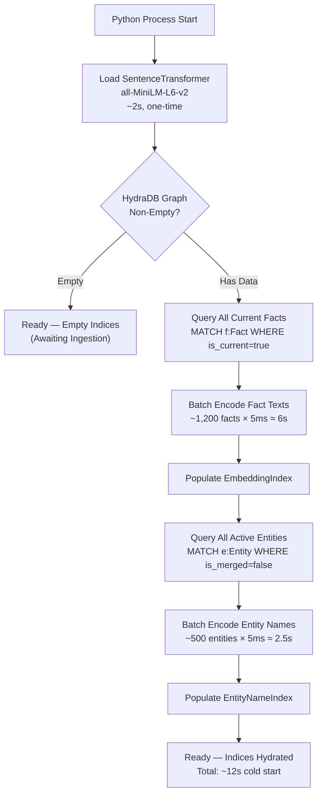

# Startup Hydration & ID Generation Strategy

Follow-up to [graph_schema_proposal.md](file:///home/aryan-sherigar/projects/hydradb-hackathon/docs/graph_schema_proposal.md), [semantic_memory_distillation.md](file:///home/aryan-sherigar/projects/hydradb-hackathon/docs/semantic_memory_distillation.md), and [entity_resolution_strategy.md](file:///home/aryan-sherigar/projects/hydradb-hackathon/docs/entity_resolution_strategy.md).

---

## 1. Design Decisions (Confirmed)

| Decision | Choice | Rationale |
|---|---|---|
| **ID generation** | Content-addressable hash → UUID format string | Same input always produces the same graph. Enables idempotent re-ingestion, diff-based debugging, and reproducible benchmark runs. |
| **Startup hydration** | Hydrate from HydraDB graph + re-embed | Graph is the single source of truth. No secondary disk cache to drift. ~6s cold start for 1,200 facts is acceptable. |
| **Re-ingestion** | Full wipe and re-ingest | Clean slate on each run. No stale data from prior prompt versions. Simplifies development iteration. |
| **Iteration speed** | Optimized for rapid prompt tuning | Expect multiple re-ingestion cycles during hackathon. Wipe-and-rebuild must be fast and reliable. |

---

## 2. Content-Addressable ID Generation

### Core Idea

Instead of sequential counters or random UUIDs, node IDs are derived from a **SHA-256 hash of a canonical semantic path** that uniquely identifies the node from the source data. This produces:

- **Deterministic**: Same LongMemEval input → same HydraDB node IDs, every run.
- **Collision-resistant**: SHA-256 truncated to 63 bits has a collision probability of ~1 in 4.6 × 10¹⁸. At our scale (~20K nodes), the birthday paradox gives a collision probability of ~4.3 × 10⁻¹¹ — negligible.
- **Partition-aware**: The hash is mapped into the appropriate ID range via modular arithmetic within the partition.

### Why UUID Format?

Using a UUID format string derived from a hash (e.g. Session ID: `hash("haystack_1_session_5")`, Turn ID: `hash("haystack_1_session_5_turn_12")`) guarantees perfect reproducibility without ever hitting an artificial ceiling or relying on sequential state.

### Hash Function

```python
import hashlib
import uuid

def content_hash_uuid(semantic_path: str) -> str:
    """
    Generate a deterministic UUID format string from a semantic path string.
    
    Args:
        semantic_path: Unique string that canonically identifies this node.
    
    Returns:
        Deterministic UUID format string.
    """
    digest = hashlib.sha256(semantic_path.encode("utf-8")).digest()
    return str(uuid.UUID(bytes=digest[:16]))
```

### Semantic Path Definitions Per Node Type

The semantic path must be **unique within the graph** and **derivable solely from the source data** (no runtime state). Each node type has a canonical path format:

| Node Type | Semantic Path Format | Example |
|---|---|---|
| **Session** | `session:{haystack_id}:{session_id}` | `session:haystack_001:session_003` |
| **Turn** | `turn:{haystack_id}:{session_id}:{turn_index}:{role}` | `turn:haystack_001:session_003:0:user` |
| **Fact** | `fact:{haystack_id}:{session_id}:{turn_index}:{fact_index}:{fact_text_hash}` | `fact:haystack_001:session_003:0:1:a3f2...` |
| **Entity** | `entity:{haystack_id}:{canonical_name}:{entity_type}` | `entity:haystack_001:max:pet` |
| **Alias** | `alias:{haystack_id}:{canonical_alias}:{parent_entity_canonical}` | `alias:haystack_001:my dog:max` |
| **Speaker** | `speaker:{haystack_id}:{role}` | `speaker:haystack_001:user` |

> [!NOTE]
> **Fact path includes a text hash** because the same turn can produce different facts on different ingestion runs (if the extraction prompt changes). The `fact_text_hash` is the first 8 hex characters of `sha256(fact_text)`. This means re-ingestion with a different prompt produces different Fact IDs, which is exactly what we want for clean wipe-and-rebuild.

> [!IMPORTANT]
> **Entity path uses canonical_name + entity_type**, not the raw surface form. This means entities created via different surface forms (e.g., "Max" and "my dog" both resolving to canonical "max") produce the same ID — they're the same node. This is a feature: entity resolution that resolves to an existing canonical name naturally gets the correct ID without a lookup.

### No More Partitions Needed

Because IDs are generated as UUID strings derived from SHA-256 hashes of the semantic paths, we no longer need to worry about integer partitions, artificial ceilings, or fixed speaker IDs. 

### Implementation: `IdGenerator` Class

```python
import hashlib
import uuid


class IdGenerator:
    """Content-addressable, deterministic UUID generator for HydraDB nodes."""
    
    @staticmethod
    def _hash_to_uuid(semantic_path: str) -> str:
        digest = hashlib.sha256(semantic_path.encode("utf-8")).digest()
        return str(uuid.UUID(bytes=digest[:16]))
    
    def session_id(self, haystack_id: str, session_id: str) -> str:
        path = f"session:{haystack_id}:{session_id}"
        return self._hash_to_uuid(path)
    
    def turn_id(self, haystack_id: str, session_id: str, turn_index: int, role: str) -> str:
        path = f"turn:{haystack_id}:{session_id}:{turn_index}:{role}"
        return self._hash_to_uuid(path)
    
    def fact_id(self, haystack_id: str, session_id: str, turn_index: int, 
                fact_index: int, fact_text: str) -> str:
        text_hash = hashlib.sha256(fact_text.encode("utf-8")).hexdigest()[:8]
        path = f"fact:{haystack_id}:{session_id}:{turn_index}:{fact_index}:{text_hash}"
        return self._hash_to_uuid(path)
    
    def entity_id(self, haystack_id: str, canonical_name: str, entity_type: str) -> str:
        path = f"entity:{haystack_id}:{canonical_name}:{entity_type}"
        return self._hash_to_uuid(path)
    
    def alias_id(self, haystack_id: str, canonical_alias: str, 
                 parent_entity_canonical: str) -> str:
        path = f"alias:{haystack_id}:{canonical_alias}:{parent_entity_canonical}"
        return self._hash_to_uuid(path)
    
    def speaker_id(self, role: str) -> str:
        # Speaker IDs are also deterministic UUIDs now based on role
        return self._hash_to_uuid(f"speaker:{role}")
```

### Collision Detection (Safety Net)

Although collision probability is negligible at our scale, we add a runtime check during ingestion:

```python
class CollisionRegistry:
    """Tracks all generated IDs to detect hash collisions at ingestion time."""
    
    def __init__(self):
        self._registry: dict[str, str] = {}  # id → semantic_path
    
    def register(self, node_id: str, semantic_path: str) -> None:
        if node_id in self._registry:
            existing_path = self._registry[node_id]
            if existing_path != semantic_path:
                raise RuntimeError(
                    f"Hash collision detected! ID {node_id} maps to both "
                    f"'{existing_path}' and '{semantic_path}'"
                )
        self._registry[node_id] = semantic_path
    
    def clear(self):
        self._registry.clear()
```

---

## 3. Startup Hydration from HydraDB

### Architecture

On process startup, the system rebuilds both in-memory indices (`EmbeddingIndex` for facts, `EntityNameIndex` for entity names) by querying HydraDB as the single source of truth, then re-encoding through `all-MiniLM-L6-v2`.



### Hydration Queries

**Step 1 — Fact Index Hydration**:
```cypher
MATCH (f:Fact {haystack_id: $hid})
WHERE f.is_current = true
RETURN f.id AS id, f.text AS text, f.haystack_id AS haystack_id
```

If hydrating across all haystacks (global ingestion mode), omit the `haystack_id` filter:
```cypher
MATCH (f:Fact)
WHERE f.is_current = true
RETURN f.id AS id, f.text AS text, f.haystack_id AS haystack_id
```

> [!WARNING]
> HydraDB does not support `IS NULL` in `WHERE`, so we cannot filter `WHERE f.is_current = true AND f.haystack_id IS NOT NULL`. However, all Facts have `haystack_id` set at creation time per our schema, so this is not a concern.

**Step 2 — Entity Name Index Hydration**:
```cypher
MATCH (e:Entity)
WHERE e.is_merged = false
RETURN e.id AS id, e.name AS name, e.entity_type AS entity_type, e.haystack_id AS haystack_id
```

### Hydration Implementation

```python
from sentence_transformers import SentenceTransformer
import numpy as np


class HydrationManager:
    """Rebuilds in-memory indices from HydraDB on startup."""
    
    def __init__(self, driver, model: SentenceTransformer):
        self.driver = driver
        self.model = model
    
    def hydrate_fact_index(self, embedding_index, haystack_id: str | None = None) -> int:
        """
        Populate EmbeddingIndex from HydraDB.
        
        Args:
            embedding_index: The EmbeddingIndex instance to populate.
            haystack_id: If provided, hydrate only this haystack. None = all.
        
        Returns:
            Number of facts hydrated.
        """
        with self.driver.session() as session:
            if haystack_id:
                result = session.run(
                    "MATCH (f:Fact {haystack_id: $hid}) "
                    "WHERE f.is_current = true "
                    "RETURN f.id AS id, f.text AS text, f.haystack_id AS haystack_id",
                    hid=haystack_id
                )
            else:
                result = session.run(
                    "MATCH (f:Fact) "
                    "WHERE f.is_current = true "
                    "RETURN f.id AS id, f.text AS text, f.haystack_id AS haystack_id"
                )
            
            rows = list(result)
        
        if not rows:
            return 0
        
        # Batch encode for efficiency (much faster than per-fact encoding)
        texts = [row["text"] for row in rows]
        embeddings = self.model.encode(texts, normalize_embeddings=True, batch_size=64)
        
        for row, vec in zip(rows, embeddings):
            embedding_index._embeddings[row["id"]] = vec
            embedding_index._haystacks[row["id"]] = row["haystack_id"]
        
        embedding_index._dirty = True
        return len(rows)
    
    def hydrate_entity_index(self, entity_name_index, haystack_id: str | None = None) -> int:
        """
        Populate EntityNameIndex from HydraDB.
        
        Returns:
            Number of entities hydrated.
        """
        with self.driver.session() as session:
            if haystack_id:
                result = session.run(
                    "MATCH (e:Entity {haystack_id: $hid}) "
                    "WHERE e.is_merged = false "
                    "RETURN e.id AS id, e.name AS name, "
                    "e.entity_type AS entity_type, e.haystack_id AS haystack_id",
                    hid=haystack_id
                )
            else:
                result = session.run(
                    "MATCH (e:Entity) "
                    "WHERE e.is_merged = false "
                    "RETURN e.id AS id, e.name AS name, "
                    "e.entity_type AS entity_type, e.haystack_id AS haystack_id"
                )
            
            rows = list(result)
        
        if not rows:
            return 0
        
        names = [row["name"] for row in rows]
        embeddings = self.model.encode(names, normalize_embeddings=True, batch_size=64)
        
        for row, vec in zip(rows, embeddings):
            entity_name_index._embeddings[row["id"]] = vec
            entity_name_index._haystacks[row["id"]] = row["haystack_id"]
            entity_name_index._types[row["id"]] = row["entity_type"]
            entity_name_index._names[row["id"]] = row["name"]
        
        return len(rows)
    
    def is_graph_empty(self) -> bool:
        """Check if HydraDB has any data."""
        with self.driver.session() as session:
            result = session.run(
                "MATCH (n:Session) RETURN count(*) AS cnt"
            )
            row = result.single()
            return row["cnt"] == 0
```

### Cold Start Performance Budget

| Step | Duration | Notes |
|---|---|---|
| Load `SentenceTransformer` model | ~2s | One-time, cached in memory after first load |
| Query HydraDB for Facts | ~200ms | Single Bolt query, ~1,200 rows |
| Batch-encode 1,200 fact texts | ~3s | `model.encode(batch_size=64)` is 5-10× faster than per-item |
| Query HydraDB for Entities | ~100ms | Single Bolt query, ~500 rows |
| Batch-encode 500 entity names | ~1s | Short strings, faster than fact texts |
| **Total cold start** | **~6-7s** | Acceptable for hackathon iteration |

> [!TIP]
> **Batch encoding is critical.** `SentenceTransformer.encode()` with `batch_size=64` amortizes GPU/CPU kernel launch overhead. Encoding 1,200 facts individually takes ~6s; batch encoding takes ~3s. Always pass a list, never call `.encode()` in a loop.

---

## 4. Full Wipe & Re-Ingestion Procedure

### Wipe Strategy

Since HydraDB supports `DETACH DELETE` and we confirmed single-writer serialized access, the wipe procedure is straightforward:

```python
class IngestionManager:
    """Manages the full ingestion lifecycle: wipe, ingest, hydrate."""
    
    def __init__(self, driver, embedding_index, entity_name_index, 
                 hydration_manager, id_generator, extractor_llm, entity_resolver):
        self.driver = driver
        self.embedding_index = embedding_index
        self.entity_name_index = entity_name_index
        self.hydration = hydration_manager
        self.id_gen = id_generator
        self.extractor = extractor_llm
        self.resolver = entity_resolver
        self.collision_registry = CollisionRegistry()

    def wipe_graph(self) -> None:
        """
        Delete all nodes and relationships from HydraDB.
        Clear all in-memory indices.
        """
        node_labels = ["Fact", "Turn", "Session", "Entity", "Alias"]
        
        with self.driver.session() as session:
            for label in node_labels:
                session.run(f"MATCH (n:{label}) DETACH DELETE n")
        
        # Clear in-memory indices
        self.embedding_index._embeddings.clear()
        self.embedding_index._haystacks.clear()
        self.embedding_index._dirty = True
        self.embedding_index.matrix = None
        
        self.entity_name_index._embeddings.clear()
        self.entity_name_index._haystacks.clear()
        self.entity_name_index._types.clear()
        self.entity_name_index._names.clear()
        
        self.collision_registry.clear()
    
    def full_reingest(self, source_data: list[dict]) -> dict:
        """
        Wipe everything, re-ingest from source JSON, return stats.
        
        Args:
            source_data: Parsed contents of longmemeval_s_cleaned.json
        
        Returns:
            Dict with ingestion statistics.
        """
        self.wipe_graph()
        
        stats = {
            "sessions_created": 0,
            "turns_created": 0,
            "facts_extracted": 0,
            "entities_created": 0,
            "entities_resolved": 0,
            "aliases_created": 0,
        }
        
        # Collect unique haystacks from all questions
        haystacks = self._collect_unique_haystacks(source_data)
        
        for haystack_id, sessions in haystacks.items():
            haystack_stats = self._ingest_haystack(haystack_id, sessions)
            for key in stats:
                stats[key] += haystack_stats.get(key, 0)
        
        return stats
```

### Wipe Ordering

> [!IMPORTANT]
> HydraDB requires `DETACH DELETE` to remove nodes that have relationships. The order doesn't strictly matter with `DETACH DELETE` (it handles dangling edges), but we delete leaf nodes first for clarity:
> 1. `Alias` (leaf — only incoming `HAS_ALIAS`)
> 2. `Fact` (has outgoing `EXTRACTED_FROM`, `ABOUT`, `STATED_BY`, `SUPERSEDES`)
> 3. `Turn` (has incoming `EXTRACTED_FROM`, outgoing from `Session`)
> 4. `Entity` (has incoming `ABOUT`, `STATED_BY`, outgoing `HAS_ALIAS`, `RELATES_TO`, `MERGED_INTO`)
> 5. `Session` (root — has outgoing `HAS_TURN`)

---

## 5. End-to-End Startup Sequence

```python
import logging
from neo4j import GraphDatabase
from sentence_transformers import SentenceTransformer

log = logging.getLogger(__name__)


def bootstrap_system(bolt_uri: str, auth_token: str) -> dict:
    """
    Initialize the complete memory system.
    Returns a dict of all initialized components.
    """
    # 1. Connect to HydraDB
    driver = GraphDatabase.driver(bolt_uri, auth=(auth_token, ""))
    log.info("Connected to HydraDB at %s", bolt_uri)
    
    # 2. Load embedding model (shared across all indices)
    model = SentenceTransformer("sentence-transformers/all-MiniLM-L6-v2")
    log.info("Loaded SentenceTransformer model")
    
    # 3. Initialize in-memory indices (empty)
    from embedding_index import EmbeddingIndex
    from entity_resolution import EntityNameIndex
    
    embedding_index = EmbeddingIndex(model)
    entity_name_index = EntityNameIndex(model)
    
    # 4. Initialize managers
    hydration = HydrationManager(driver, model)
    id_gen = IdGenerator()
    
    # 5. Hydrate from graph if non-empty
    if not hydration.is_graph_empty():
        n_facts = hydration.hydrate_fact_index(embedding_index)
        n_entities = hydration.hydrate_entity_index(entity_name_index)
        log.info("Hydrated %d facts and %d entities from HydraDB", n_facts, n_entities)
    else:
        log.info("HydraDB graph is empty — ready for ingestion")
    
    return {
        "driver": driver,
        "model": model,
        "embedding_index": embedding_index,
        "entity_name_index": entity_name_index,
        "hydration_manager": hydration,
        "id_generator": id_gen,
    }
```

---

## 6. Idempotency Guarantees

Because IDs are content-addressable:

| Scenario | Behavior |
|---|---|
| **Same data, same prompt, re-ingest** | Produces identical node IDs. `MERGE` would be a no-op if we used it. With wipe-and-rebuild, the graph is identical. |
| **Same data, different prompt** | Fact text changes → `fact_text_hash` changes → different Fact IDs. Entity and Session/Turn IDs remain the same (they don't depend on extracted text). Clean separation. |
| **Different haystack data** | Completely different semantic paths → completely different IDs. No collision risk. |
| **Two runs compared** | IDs for unchanged components are identical across runs, making diff-based debugging trivial: "Which facts changed between prompt v1 and v2?" |

---

## 7. Summary of Decisions

| Decision | Choice | Key Reason |
|---|---|---|
| ID generation | SHA-256 content hash → UUID format string | Deterministic, reproducible, debuggable; same input always → same graph |
| Semantic path format | `{type}:{haystack_id}:{unique_components}` | Unique within graph, derivable from source data, no runtime state |
| Collision handling | Runtime `CollisionRegistry` check during ingestion | Safety net; probability is ~10⁻¹¹ at our scale but worth the 3 lines of code |
| Startup hydration | Query HydraDB → batch re-embed | Graph is single source of truth; ~6-7s cold start is acceptable |
| Re-ingestion | Full wipe via `DETACH DELETE` per label + clear in-memory indices | Clean slate; no stale data; iteration-friendly |
| Batch encoding | `model.encode(texts, batch_size=64)` | 2× faster than per-item encoding |
