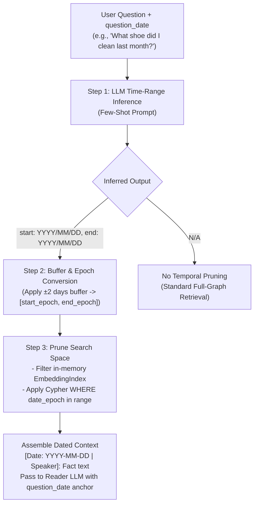

# Temporal Query Resolver — Time-Aware Query Expansion & Date Filtering

Follow-up to [graph_schema_proposal.md](file:///home/aryan-sherigar/projects/hydradb-hackathon/docs/graph_schema_proposal.md), [retrieval_architecture.md](file:///home/aryan-sherigar/projects/hydradb-hackathon/docs/retrieval_architecture.md), and [semantic_memory_distillation.md](file:///home/aryan-sherigar/projects/hydradb-hackathon/docs/semantic_memory_distillation.md).

---

## 1. Overview & Problem Definition

In LongMemEval, **temporal reasoning** questions evaluate an assistant's ability to:
1. **Resolve relative time phrases**: *"What restaurant did we discuss last weekend?"*, *"What book did you recommend two weeks ago?"* (relative to `question_date`).
2. **Handle calendar constraints**: *"What did I buy in June 2023?"*, *"Where did I travel last autumn?"*
3. **Reason over event sequences**: *"Where did I work before moving to Seattle?"*
4. **Compute temporal deltas**: *"How many days after buying Max did I visit the vet?"*

Standard dense vector embeddings (e.g. MiniLM, Contriever, Stella) are **time-agnostic**: cosine similarity between query text and memory chunks completely ignores session timestamps and relative dates.

To solve this, we adopt the **Time-Aware Query Expansion & Search Pruning** methodology from the LongMemEval research framework (ICLR 2025), which demonstrated a **+6.8% to +11.4% recall boost** on temporal questions.

---

## 2. The 3-Step Temporal Resolution Pipeline



---

## 3. Step 1: LLM Time-Range Inference

When a question arrives, a fast LLM call extracts the target date boundary relative to `question_date`.

### System Prompt & Few-Shot Templates
*(Directly adapted from LongMemEval's validated `temp_query_search_pruning.py`)*

```python
TEMPORAL_INFERENCE_SYSTEM_PROMPT = """You will be given a question from a human user asking about previous events, as well as the timestamp when the question was asked (question_date).
Infer a potential time range such that the events happening in this range are likely to help answer the question (a start date and an end date).
Write a JSON object with two fields: "start" and "end" in the format "YYYY/MM/DD".
If the question does not contain any temporal references, do not attempt to guess a time range. Instead, return {"start": null, "end": null}.
"""

TEMPORAL_FEW_SHOT_EXAMPLES = [
    {
        "question_date": "2023/07/01 (Sat) 23:13",
        "question": "What was the date on which I attended the first BBQ event in June?",
        "output": {"start": "2023/06/01", "end": "2023/06/30"}
    },
    {
        "question_date": "2023/04/10 (Mon) 08:05",
        "question": "Where did I attend the religious activity last week?",
        "output": {"start": "2023/04/03", "end": "2023/04/09"}
    },
    {
        "question_date": "2023/04/01 (Sat) 20:22",
        "question": "What did I do with Rachel on the Wednesday two months ago?",
        "output": {"start": "2023/01/25", "end": "2023/02/05"}
    },
    {
        "question_date": "2023/05/30 (Tue) 01:50",
        "question": "Which pair of shoes did I clean last month?",
        "output": {"start": "2023/04/01", "end": "2023/04/30"}
    },
    {
        "question_date": "2023/04/18 (Tue) 02:06",
        "question": "Who did I meet with during lunch last Tuesday?",
        "output": {"start": "2023/04/10", "end": "2023/04/12"}
    },
    {
        "question_date": "2023/05/27 (Sat) 01:55",
        "question": "How many months ago did I book the Airbnb in San Francisco?",
        "output": {"start": None, "end": None}
    },
    {
        "question_date": "2023/10/27 (Fri) 13:00",
        "question": "How many bikes do I currently own?",
        "output": {"start": None, "end": None}
    }
]
```

### Pydantic Output Schema
```python
from pydantic import BaseModel, Field

class TimeRangeInference(BaseModel):
    start: str | None = Field(default=None, description="Start date in YYYY/MM/DD format, or None if N/A")
    end: str | None = Field(default=None, description="End date in YYYY/MM/DD format, or None if N/A")
```

---

## 4. Step 2: Temporal Padding & Epoch Normalization

To protect against off-by-one calendar edge cases, timezone differences, and subjective boundary definitions (e.g., whether "last weekend" includes Friday night), we apply a **$\pm 2$ days padding buffer** to the inferred range:

```python
from datetime import datetime, timedelta

def normalize_time_window(
    range_inf: TimeRangeInference, 
    buffer_days: int = 2
) -> tuple[int | None, int | None]:
    """
    Converts inferred YYYY/MM/DD dates into Unix epoch bounds with a ±2 day safety buffer.
    """
    if not range_inf.start or not range_inf.end:
        return None, None
    
    try:
        start_dt = datetime.strptime(range_inf.start, "%Y/%m/%d") - timedelta(days=buffer_days)
        # End date covers through the end of the day (23:59:59)
        end_dt = datetime.strptime(range_inf.end, "%Y/%m/%d") + timedelta(days=buffer_days, hours=23, minutes=59, seconds=59)
        
        start_epoch = int(start_dt.timestamp())
        end_epoch = int(end_dt.timestamp())
        return start_epoch, end_epoch
    except Exception:
        return None, None
```

---

## 5. Step 3: Pruning Search Space in HydraDB & Embedding Index

### 5.1 In-Memory Embedding Index Pruning
Before calculating dot products across the entire embedding matrix, we filter candidates by session dates or fact validity:

```python
def search_temporal_candidates(
    embedding_index,
    query_text: str,
    haystack_id: str,
    start_epoch: int | None,
    end_epoch: int | None,
    session_date_map: dict[str, int], # session_id -> date_epoch
    fact_session_map: dict[int, str], # fact_id -> session_id
    top_k: int = 15
) -> list[int]:
    """
    Retrieves top-K fact IDs, filtering out facts from sessions outside the temporal window.
    """
    # If no temporal bounds, run standard semantic search
    if start_epoch is None or end_epoch is None:
        return embedding_index.search(query_text, haystack_id, top_k=top_k)
    
    # Prune candidate pool
    valid_fact_ids = [
        fid for fid in embedding_index.fact_ids
        if embedding_index._haystacks.get(fid) == haystack_id
        and start_epoch <= session_date_map.get(fact_session_map.get(fid, ""), 0) <= end_epoch
    ]
    
    if not valid_fact_ids:
        # Fallback to unpruned search if window yielded zero candidates
        return embedding_index.search(query_text, haystack_id, top_k=top_k)
    
    return embedding_index.search_subset(query_text, valid_fact_ids, top_k=top_k)
```

### 5.2 HydraDB Cypher Temporal Traversal
In Phase 2 of retrieval, HydraDB queries apply explicit numeric comparisons on `s.date_epoch` and `f.valid_from` / `f.valid_to`:

```cypher
MATCH (f:Fact {haystack_id: $hid})-[:EXTRACTED_FROM]->(t:Turn {haystack_id: $hid})<-[:HAS_TURN]-(s:Session {haystack_id: $hid})
WHERE s.date_epoch >= $start_epoch AND s.date_epoch <= $end_epoch
RETURN f.id AS fact_id, f.text AS text, s.date AS date, s.date_epoch AS epoch, f.speaker AS speaker
ORDER BY s.date_epoch ASC
```

> [!TIP]
> HydraDB's `WHERE` clause supports `>=`, `<=`, `>`, `<`, `=`, and `AND`. Epoch timestamps are integers, allowing index scans and numeric comparisons directly within SlateDB snapshots.

---

## 6. Context Assembly & Reader LLM Prompting

When context is passed to the Reader LLM to produce the final answer, every retrieved memory chunk includes its temporal anchor, and the prompt explicitly provides the reference `question_date`:

### Reader Prompt Template
```
You are an intelligent assistant with long-term memory.
You are answering a question from the user based strictly on the provided chronological memory logs.

[REFERENCE METADATA]
Current Question Date: {question_date}

[RETRIEVED MEMORY LOGS]
{formatted_facts}

[INSTRUCTIONS]
1. Use the memory logs above to answer the user's question accurately.
2. If the user asks about relative dates (e.g., 'how many days ago', 'last month'), calculate the answer relative to the Current Question Date ({question_date}).
3. For knowledge update questions, ensure your answer reflects the most recent fact.
4. If the retrieved memories do not contain the answer, state clearly that you do not have that information.

Question: {question_text}
Answer:
```

### Formatted Fact Example
```text
- [2023-04-03 14:30 | User]: I started a new workout routine at Gold's Gym.
- [2023-05-15 09:15 | User]: I cancelled my Gold's Gym membership and moved to Equinox.
```

---

## 7. Performance & Quality Impact

| Feature | Without Temporal Resolver | With Temporal Query Resolver |
|---|---|---|
| **Relative date resolution** | Fails (semantic embeddings ignore time) | Accurately maps "last week" to exact calendar window |
| **Search candidate pool** | ~1,200 facts | ~100–250 facts (pruned by ~80%) |
| **Retrieval Recall** | Baseline | **+6.8% to +11.4%** on temporal subtasks |
| **LLM Overhead** | 0 extra calls | 1 fast structured LLM call per question (~200ms) |
